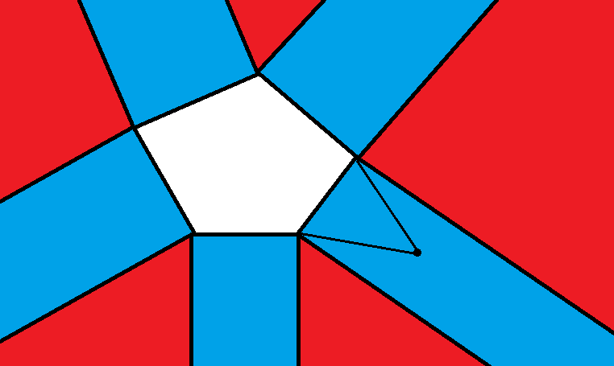
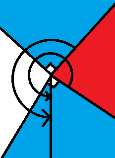

题面以及提交在 [QOJ](http://qoj.ac/category/5)。

约定：

- $W$ 如无特殊说明即为题目给定的值域，$T$  如无特殊说明即为题目给定数组组数。
- 由于空间复杂度随实现而异，不给出。

# PTZ winter 2020 Day1

## A

考虑我们可以把一个任意的左右括号数相同的序列循环移位成一个合法的括号串。具体的，把左括号看作 $1$，右括号看作 $-1$，那我们找到前缀和的最小值（多个取编号最小的），我们把这段前缀移到串后面即可。

这样需要记录我们从哪里开始是原来的前缀，需要的整数值域在 $[0,2n]$ 里。但是假设这段前缀是 $S$，剩下的是 $T$，我们可以知道 $S$ 的最后一个数是 $-1$，且后缀最小值大于 $0$，那么我们在 $T$ 后面接一个 $-1$，再接一个 $S$，再删去最后一个数字（显然这个是 $-1$），得到的一定是一个合法的括号串。这个时候原来前缀开始的位置的前一个数一定是 $-1$，那么只需要知道这个是第几个 $-1$ 即可。由于有 $S$ 是空串（即原串就是合法的括号串）的情况，所以我们需要的整数值域在 $[0,n]$。

观察上述过程发现括号串加一个在 $[0,n]$ 的整数形成的二元组和一个左右括号数相同的序列是双射，也说明了卡特兰数为 ${2n\choose n}\over n+1$。

## C

考虑可以走非整点的话，就是直接沿着起点和圆心的连线走直到圆上。

整点的话，就在非整点情况下的终点附近找一个整点作为终点，直接在附近两维绝对值小于 $10$ 的即可。

## F

考虑直接用 `bitset` 优化 `sg` 值转移，复杂度是 $O(\frac{rc(r+c)}{w})$，然后求方案的话，存一个点能到达的点的 `sg` 值空间太大，考虑离线下来再模拟原来推 `sg` 的过程即可。

复杂度 $O(\frac{rc(r+c)}{w}+\sum n(r+c))$。

## H

考虑找出所有本质勾股数，$(m^2-n^2,2mn,m^2+n^2)$，发现只有 $4e7$ 个，打表通过该题。

## I

考虑相当于可以花 $y$，把某个序列砍成两个。把 `+` 看作 $1$，`?` 看作 $0$，那么一个序列的贡献就是这个序列的逆序对数。

考虑我们认为 `?` 把整个序列割成 $m$ 段，每段的 ` +` 个数为 $a_i$。

设 $f_i$ 表示只考虑前 $i$ 段的答案，那么有 $f_i\leftarrow f_j+y+w(j+1,i)$。其中 $w(l,r)=\sum\limits_{i=l}^r a_i\times(r-i)$。

设 $suf_i=\sum_{j=i}^n a_j,sufi_i=\sum_{j=i}^n a_j(n-j+1)$。

那么 $w(l,r)=sufi_l-sufi_{r+1}+(r-1-n)(suf_l-suf_{r+1})$。

拆开后看起来非常斜率优化，直接做即可。

复杂度 $O(n)$。

## L

首先我们知道如果按照 $x+y$ 的奇偶性来分类，那么每个类的大小一定都超过 $2$，不然题目一定无解。

首先在保证每种奇偶性都至少 $2$ 只象的情况先把象远离王，放在四个不同的斜率为 $-1$ 的直线上。然后显然我们可以在 $10$ 步内做到下面的情况：

然后像下面三幅图一样 $3$ 步把王逼死。

# PTZ winter 2020 Day2

## C

首先观察到每个点不会被超过三条线段覆盖，不然一定不优。同时，两个包含的线段只会取其中一条。

考虑把线段都按右端点排序，考虑 $f_i$ 为以第 $i$ 条线段为最右边的操作时，答案的最大值。

那么考虑转移，对于那些与自己颜色不同的线段 $l_j\le l_i\le r_j$，贡献是 $x(r_i-l_i+1)+f_j-(r_j-l_i+1)(x+y)=x(r_i-l_i+1)-x-y+f_j-r_j(x+y)+(x+y)l_i$，可以直接线段树维护。剩下的都是简单情况。

发现这样对于有三条线段覆盖同一点的方案，答案会算少，但是它们本来就不优，不会影响答案。

复杂度 $O(n\log n)$。

## E

题目问的就是把序列划分成两个长度都不超过 $m$ 的上升子序列的方案数。

首先有解的必要条件就是最长下降子序列小于等于 $2$。那么我们把所有前缀最大值作为分段点，那么每段都必须是上升序列。

考虑对于一个数 $a_i$ 而言，$\forall j>i,a_j< a_i$，这些 $j$ 都必须被划到同一个上升子序列里。

也就是说，两个相邻的前缀最大值之间的数都必须被划到同一个上升子序列中。

那么假如出现下面的情况：

其中黑色是前缀最大值，然后就发现两个红色的段也必须要在同一组，两个前缀最大值也必须要在同一组。

我们从后往前扫，每次出现这种情况就合并，直到不能合并为止，然后最后就会变成下面的情况：

其中每个块都包含了若干个必须被划到同一段的数（红块大小可能为 $0$）。

注意到每个黑块和它右边的那个红块必须被分在不同的组，其他没有限制。如果没有 $m$ 的限制，那么答案就是 $2^{\text{黑块个数}}$。有限制就直接 `dp` 即可。

复杂度 $O(n^2)$。

## G

下面设 $w=16$。

我们需要找到一个串，使得它有两种不同的凑法。

那么我们设 $f_{i,j}$ 表示，我们凑出来了两个串，一个串长度是 $x$，另一个是 $x+j$，两个串的前 $x$ 个字符完全相等，第二个串的后 $j$ 个字符是第 $i$ 个模式串的长度为 $j$ 的后缀，这种情况下 $x$ 的最小值。

我们把每对 $(i,j)$ 看作点，那么就是一个最短路的形式，注意到边数 $m\propto wn^2$，最短路的复杂度是 $O(m\log n)$，看起来不太能过，但注意到边权很小，每个点最多被更新 $w$ 次，所以复杂度其实是 $O(w^2n\log n+m)$，能过。

## I

首先注意到无向图中不存在割边的连通块一定可以被定向成一个强连通块，那么我们把边双连通分量缩起来就变成了树的情况了，直接求 `lca` 做。

复杂度 $O(n+m+k\log n)$。

## K

考虑到我们最优解中，每个格子至多被竖着的线段覆盖一次，横着的同理，所以我们不需要考虑超过一次的情况。

我们可以设 $Hb_{i,j},Vb_{i,j},Hw_{i,j},Vw_{i,j}$，分别为是否被黑/白的竖着/横着的线段覆盖了。

以黑色竖线为例，花费是 $a\sum Hb_{i,j}+b\sum Hb_{i,j}\overline {Hb_{i+1,j}}$。

然后考虑图形的限制，对于一个要是黑色的点，花费就是 $c\overline {Hb_{i,j}}\overline {Vb_{i,j}}+\infty (Hw_{i,j}+Vw_{i,j})$，后面是因为如果染了白色就染不上黑色了。

对于白色的点，花费为 $c(Hb_{i,j}\overline {Vw_{i,j}}+Vb_{i,j}\overline {Hw_{i,j}})+\infty Hb_{i,j}Vb_{i,j}$，后面是因为一个格子只能染两次。

这些可以建成最小割模型求解，具体的，假设 $S$ 是源点，$T$ 是汇点，对每个变量建一个点。

把 $Hw_{i,j}$ 和 $Vb_{i,j}$ 的意义取反，所有式子都变成 $cX\overline Y$ 的形式，那么可以看作 $Y$ 向 $X$ 连了一条边权为 $C$ 的边。

对于 $cX$ 的权值，看作 $S$ 向 $X$ 连了一条边权为 $c$ 的边，对于 $c\overline X$，看作 $x$ 向 $T$ 连了一条边权为 $c$ 的边。

复杂度 $O((nm)^{3})$，网络流玄学。

# PTZ winter 2020 Day3

## B

特判 $n=2$ 的情况。

考虑非叶节点的个数为 $x$，那么答案就是 $\min(\lfloor\frac{n}{2}\rfloor,x)$。

构造考虑假如 $x<  \frac{n}{2}$，那么给每个非叶节点挂一个叶节点，然后让它们匹配，剩下的随便求出生成树。

对于 $x\ge\frac{n}{2}$，构造比较显然。

## C

考虑我们找到一条尽可能靠左下（即，可以向下就向下，否则向右）的 $(1,1)$ 到 $(n,m)$ 的路径 $U$ 和一条尽可能靠右上的路径 $V$，那么假如我们只能 ban 一个位置，我们需要的就是把一个同时出现在两条路径上的位置 ban 了，相当于求两条路径的交集大小。

现在我们可以 ban 两个位置，假如我们其中一个 ban 了同时出现在 $U,V$ 的位置，那么另一个可以随便放一个，先单独算这种情况。接下来，我们考虑 ban 掉只在 $U$ 上的位置，这样我们求出新的尽可能靠左下的路径 $U^\prime$，那么另一个石头的选择数就是 $U^\prime,V$ 交集大小。

考虑我们先找出所有可以被 $(1,1)$ 到达的且可以到达 $(n,m)$ 的点，假如我们把 $(x,y)$ ban 了，我们找到 $x^\prime+y^\prime=x+y$ 且 $y^\prime$ 最小，则 $U^\prime$ 一定是经过 $(x^\prime,y^\prime)$ 的尽可能靠左下的路径。接下来不难 $O((n+m)^2)$ 或 $O(nm)$ 得到答案。

## D

我们知道一个排列和一个由两个形状相同的标准杨表形成的有序对成双射，杨表的第一行长度就是排列 `LIS` 长度。那么题目要求的就是杨表第一行和第二行长度一样。

直接枚举分拆数，用钩子公式算杨表数，$O(nE)$，其中 $E$ 为满足最大两个数相同的分拆方案数，在 $n=75$ 时，$E=1028764$，能过。

## E

考虑我们所求 $ans_j=[\oplus_{i=1}^n a_i\%(j+1)>0]$。考虑怎么求 $\oplus_{i=1}^n a_i\%(j+1)$。

考虑分别求每一位，求 $2^k$ 次方时，就相当于询问有哪些 $a_i\%(j+1)\%2^{k+1}\equiv 2^k$，我们统计 $c_i$ 为 $i$ 的出现次数，那么就相当于对 $n/(j+1)$ 段询问间隔为 $2^k$ 的位置的 $c_i$ 的和，前缀预处理即可。

复杂度 $O(n\log^2n)$。

## F

考虑每个怪一定是你先砍到它血量 $\%b<  a$，然后等对手砍到 $<  b$，然后补刀。那么考虑算出 $a_i= \lceil\frac{(h_i-1)\% b+1}{a}\rceil,b_i=\lceil\frac{h_i}{b}\rceil$。那么如果我们不打一个怪，它可以送我们 $b_i$ 次机会，否则会提供我们 $b_i-a_i-1$ 次机会（如果是负数就是要消耗 $1-b_i+a_i$ 次机会），由于我们是先手，多一次机会，所以我们的要求就是前缀和都大于等于 $-1$。

那么每次我们都贪心地打怪，如果打完之后前缀和小于 $-1$，就选择原本选择打的那些怪中 $a_i+1$ 最大的那只怪不打。复杂度 $O(n\log n)$。

## G

考虑我们随意选择一个生成树进行点分治。此时注意到由于包含分治中心的环至多 $k$ 个，所以跨越不同子树的非树边也至多 $k$ 条，对于每个这样的边，我们都分别选出一个端点，我们称这些点以及分治中心是**有用**的。假如我们把路径跨越**有用**点的情况处理了，那么删掉**有用**点后仍两个不同子树之间没有连边，可以分治下去。

对于询问和修改，我们把它们下放到点分治过程中，每个操作只会被考虑 $O(\log n)$ 次。在分治中，因为我们只需考虑跨越**有用**点的路径，所以我们可以预先从每个**有用**点开始 bfs 求出到每个点的距离，然后维护距离每个**有用**点最近的标记点即可。

复杂度 $O((n+q)k\log n+m\alpha(n))$。

## H

首先排序不会影响答案，假设 $a_i$ 不降。

设 $f_{i,j,k}$ 表示考虑了左部前 $i$ 个点，右部前 $a_i$ 个点，现在选出来的那些在环里的连通块，有 $j$ 个点，有 $k$ 条链的方案。每次转移到 $i+1$ 就是先逐一考虑 $a_{i+1}-a_i$ 这些点是否要在环里，然后考虑左边第 $i+1$ 个点是否在环里，如果是，考虑连了右部哪两个点，合并它们的连通块。

考虑这样非常难转移，因为点和点连接是 $1$ 种方案，点和链是 $2$ 种，链和链是 $4$ 种。但是我们可以假装链是有向的，那么发现上面的方案都变成 $2$ 了，于是状态里就不需要把点和链分开记了，只需要记录连通块数了。

有向链最后统计出来也是有向环，答案要除二。（以及，二元环是不应该被计算进答案的）

答案就是 $\sum\limits_{i=1}^{n} f_{i-1,1}-\sum\limits_{i=1}^na_i\over 2$，这里 $f_{i-1,1}$ 是因为要用左部第 $i$ 个点来把链变成环。

复杂度 $O(n^2+n\max a_i)$。

## J

考虑答案一定有解，所以我们只需要把点的限制看作方程，求出秩 $rk$，那么答案就是 $5^{m-rk}$。

我们可以每个连通块分别做，所以下面假设图连通。

如果图是二分图，那么秩就是 $n-1$（考虑求出生成树后，当非树边的权值确定时，树边的方案唯一）。

然后发现秩不会超过 $n$，因为只有 $n$ 个方程。考虑加方程不会让秩减小，生成树的秩是 $n-1$，基环是奇环的基环树的秩是 $n$，所以非二分图秩就是 $n$。

复杂度 $O(n+m)$。

# PTZ winter 2020 Day5

## A

设 $X(n)=\pi(n)-\pi(\lfloor n/2\rfloor)+1$，那么答案就是 $n-\lfloor (n-X(n))/2\rfloor$。

显然 $X(n)$ 就是一定不可能和其他数组成对的数的数量（大于 $n/2$ 的质数以及 $1$），我们只需证明剩下的数一定能组成 $\lfloor (n-X(n))/2\rfloor$ 对。

证明考虑把剩下的数按照最大质因子分类，设最大质因子为 $p$ 的集合为 $S_p$，显然 $2p\in S_p$，假如 $|S_p|$ 是偶数，那么直接两两匹配完，不然就匹配至剩下 $2p$。那么这些剩下的 $2p$ 也可以两两匹配。

接下来只需要考虑怎么数 $\pi(n)$。

直接 `min25` 筛是 $O(Tn^{3/4})$，可能卡过去，但本人常数太大卡不过去。

或者分块打表，复杂度 $O(\sqrt{\max n}+TB\log\log n+{\max n\over B})$，其中 $B$ 是块长，取 $B=10^7$ 可以通过。

## C

首先把 $c_i$ 从小到大排序，那么只需满足 $c_{i+1}-c_i\ge d$。

设 $y_i=c_i-id$，那么 $c_{i+1}-c_i\ge d\iff y_{i+1}\ge y_i$。在这个过程中我们需要保证 $y_i\ge -id$。

由于我们需要保证 $y_i\ge y_1\ge -d$，所以我们先把比 $-d$ 小的 $y_i$ 先提升到 $-d$，然后就不需要考虑下界的限制了。

剩下部分就是 `CF713C`。

## D

首先我们枚举一条线段 $p$ 并钦定它是我们选出方案里最短的那条，那么我们就可以忽略掉那些严格在它内部的线段以及与它无交的线段，然后对于剩余的线段，如果一条线段同时包含了 $p$ 的两个端点，那么它加入方案一定更优，我们记录下这样的线段的数量然后忽略它们。

剩下的线段只有那些恰好包含 $p$ 一个端点的线段。我们设 $A$ 为包含 $p$ 左端点的线段的集合，$B$ 为包含 $p$ 右端点的集合。那么我们只需要保证，对于选出的线段 $a,b$，假如 $a\in A,b\in B$，那么 $a,b$ 必须有交。设 $len_i$ 为线段 $i$ 的长度，$in_i$ 为线段 $i$ 和 $p$ 交的长度，$out_i$ 为 $len_i$ 减去 $in_i$，那么就是要保证 $in_a+in_b> len_p\lor out_a+out_b>n-len_p$。把一个 $A$ 中的线段看作黑点 $(in_a,out_a)$，$B$ 中的线段看作白点 $(len_p-in_b,n-len_p-out_b)$。那么就是要选出一个点集，要保证不存在一个黑点处于某一个白点的左下方。

那么就是选择一条单调不降的折线，把折线下方的白点都加入答案，折线上方的黑点都加入答案，这一步可以直接 `dp`。

复杂度 $O(n^2\log n)$。

## E

注意，题目中说的无交是严格无交，即两个圆不能相切。

那么就是查询是否有一个圆，使得 $p_x\le c_x\le q_x\land c_y-r\le y_{min}\land y_{max}\le c_y+r$。

离线+扫描线，复杂度 $O(n\log n)$。

## F

考虑设 $X$ 为所有排列答案的平均值，那么设 $f_i$ 为逆序对数为 $i$ 的排列的答案，就有 $f_i=\min\{b+(n(n-1)/2-i)a,ia,X+c\}$。设 $c_i$ 为逆序对数为 $i$ 的排列数量，就有 $Xn!=\sum f_ic_i$。

考虑把排列按照 $g_i=\min\{b+(n(n-1)/2-i)a,ia\}$ 排序，那么我们就可以枚举 $X+c$ 在哪两个 $g$ 之间，然后算出 $X$，如果满足假设，则我们找出了 $X$。

到此处复杂度为 $O(n^3+n^2\log n)$。

每次询问算出给定排列的逆序对数即可。

复杂度 $O(n^3+n^2\log n+dn\log n)$。

## H

注意，题目中的简单路径是指任意两条边除了顶点不交，且不能经过重复的点，那么就是区间 `dp`，没了。

复杂度 $O(n^3)$。

## I

设 $B=\sum_{i=0}^{n-1} b_i10^i$ 是题目要求的数。

每次尝试把 $B$ 高位的一半干掉，即构造 $A$，使得 $\forall n>i\ge \lfloor {n1\over 2}\rfloor,a_i=a_{n-i-1}=b_i$。

但是 $A$ 可能比 $B$ 大，我们找到最大的 $p$，使得 $b_{n-p-1}>0$，然后令 $a_p=a_{n-p-1}=b_{n-p-1}-1$ 即可，特别的，如果 $p=0$，构造 $A=10^{n-1}-1$。

毛估估一个操作上界是 $2\log_3 n$，足以通过。

## J

对于给定的 $(x,y,-1)$，我们就考虑加入关键点 $(x,y,N)$。然后我们考虑维护关键点之间的连通性。假如有两个操作在同一平面内且方向不同，则它们对应的关键点连通。

对于询问，终点和起点分别向三个方向走寻找关键点查询连通性即可。

复杂度 $O(n(\log n+\alpha (n))+q\log n)$。

## K

容斥，变成找 $j$ 对一定要相邻的方案数。直接轮廓线 `dp` 就是 $O(nmk2^{\min(n,m)})$，不知道为什么可以过。

# PTZ winter 2020 Day7

## A

两个数相同当且仅当下列条件之一满足

- 两个数被一起操作了。
- 两个数分别被操作了，且两次操作的元素可以一一对应相同。

所以有解的必要条件就是 $n\mid k^{\inf}$，这也是充分的。

我们先进行 $n/k$ 次操作使得我们有 $n/k$ 组，每组数有 $k$ 个，同一组数全部相同。

假设现在我们有 $n/m$ 组，每组数有 $m$ 个（$k\mid m$），同一组数全部相同。我们可以通过构造证明，对于任意一个 $k$ 的因子 $x$，如果满足 $x\mid n/m$，那么我们可以使得 $m\leftarrow mx$。

复杂度 $O(n\log n)$。

## B

$f_i=\sum_{1\le j\le \min(\lfloor (i+k)/2\rfloor,i-1)} f_jf_{i-j}$。

分成两部分：

- $\forall j\le i,f_if_j\rightarrow f_{i+j}$。
- $\forall i<j\le i+k,f_if_j\rightarrow f_{i+j}$。

考虑半在线卷积。[细节](https://www.luogu.com.cn/blog/command-block/ban-zai-xian-juan-ji-xiao-ji)

复杂度 $O(n\log^2 n+nk)$。

## C

把 $a$ 和 $b$ 拼接。

考虑怎么算本质不同的子串个数，那么就是 $\sum\limits_{i=1}^n len_{sa_i}-lcp(sa_i,sa_{i-1})$，其中 $sa_i$ 为字典序排名为 $i$ 的后缀，$sa_0=\varnothing$。

然后这道题就是要求本质不同的某个出现位置跨过 $|a|,|a|+1$ 的子串个数，所以我们只保留前 $|a|$ 个后缀。我们从大到小枚举子串长度 $L$，然后在枚举到 $lcp(sa_i,sa_{i-1})$ 时把 $sa_{i-1}$ 删去，最后数一数剩下有几个后缀加上 $L$ 超过 $|a|+1$ 即可。

复杂度 $O(n\log n)$。

## D

先检查 $x=1$ 是否可行，然后可以对除式和被除式都乘上 $x-1$，然后除式是 $x^m-1$，所以次数都可以对 $m$ 取模。

现在假设现在的被除式是 $F(x)=\sum\limits_{i=0}^{m-1} a_ix^i$。如果 $x>\max\{e_i\}+1$，那么 $F(x)<x^m-1$，所以我们只有 $O(n)$ 个数要 `chk`。

检查 $x$ 是否可行时，我们每次找到一个位置 $|a_i|\ge x$。如果 $a_i\ge x$，我们就把 $a_i$ 减去 $x$，然后 $a_{(i+1)\%m}$ 加一。如果 $a_i\le -x$，我们就把 $a_i$ 加上 $x$，然后 $a_{(i+1)\%m}$ 减一。一直操作直到不存在 $|a_i|\ge x$，至多操作 $O(n/x)$ 步，然后 $x^m-1|F(x)$ 当且仅当 $a_i$ 全部相同，且都等于 $-x+1,0,x-1$ 其中之一。

用 `map` 和 `set` 维护，复杂度 $O(n\log^2 n)$。

## E

考虑 $P(z)=\sum\limits_{i=0}^{k}p_iz^i$，那么我们需要的就是求出 $Q(n)=P^n(z)$ 的前 $x$ 项。

考虑 $(P^{n+1}(x))^\prime=(n+1)P^n(x)P^\prime(x)=(n+1)Q(x)P^\prime(x)$，同时 $(P^{n+1}(x))^\prime=(Q(x)P(x))^\prime=Q^\prime(x)P(x)+P^\prime(x)Q(x)$。

所以有 $nQ(x)P^\prime(x)=Q^\prime(x)P(x)$。

提取两边同一次数的系数。
$$
\begin{aligned}
\ [x^i]nQ(x)P^\prime(x)=&[x^i]Q^\prime(x)P(x)\\
n\sum_{j=0}^{k-1} (j+1)p_{j+1}q_{i-j}=&\sum_{j=0}^k (i-j+1)p_jq_{i-j+1}\\
n\sum_{j=1}^{k} jp_{j}q_{i-j+1}=&\sum_{j=0}^k (i-j+1)p_jq_{i-j+1}\\
q_{i+1}=&\sum_{j=1}^{k} ((n+1)j-i-1)p_{j}q_{i-j+1}\over p_0(i+1)
\end{aligned}
$$

先求出 $q_0,\dots,q_k$，于是可以通过 $k$ 阶递推来得到答案。

复杂度 $O(xk)$。

## F

假设最后第 $i$ 个人去到的队伍是 $c_i\in\{0,1\}$，设 $l_{0/1}$ 为最后的 $0/1$ 出现的位置，那么这种局面出现的概率为 $2^{-\min(l_0,l_1)}$。

设 $m=\min(l_0,l_1),a_0=0,a_{k+1}=2n+1,c_{a_1}=c_{a_2}=\dots=c_{a_k}=0$。

当 $m=a_k$，方案数为 $m-k\choose n-k$。

当 $a_i<m<a_{i+1}(i\in[0,k])$，且 $s_m=1$，方案数为 $m-i-1\choose n-1$。

当 $a_k<m$ 且 $s_m=0$，方案数为 $m-1-k\choose n-1-k$。

由于 $k$ 的取值最多只有 $2\sqrt{2\cdot 10^5}$ 种，所以最后一个贡献可以对每一种 $k$ 预处理。

复杂度 $O(n\sqrt{2\cdot 10^5})$。

## G(unsol)

对于那些大小大于 $k/2$ 的子集，它们两两之间不能在同一组，所以答案的一个下界是 $[2\mid k]{{n\choose k/2}\over 2}+\sum\limits_{i=\lfloor k/2\rfloor+1}^k {n\choose i}$。

当 $i\ge k-i$，${n\choose i}\ge {n\choose k-i}$，所以对于一个大小为 $i(i\le k/2)$ 的小子集，我们希望它可以和一个大小为为 $k-i$ 的大子集匹配。如果这可以做到，那么答案就能取到下界。

对于 $i<k/2$ 的部分，由 `Hall` 定理可以知道一定有解。对于 $i=k/2$，在数据范围内可以通过构造证明有解。

然后似乎有一百种方法构造匹配，但是我一个都不会哈哈哈，我是菜鸡。

## H

考虑如何让所有线段都至少包含一个点：我们每次选择一个没有包含点的 $r_i$ 最小的线段，在 $r_i$ 处放一个点。

假设现在包含点最多的线段包含了 $t$ 个点，那么答案一定 $\ge t-1$，因为至少有 $t-1$ 个两两不交线段被它完全包含。

所以我们只需要尝试答案是否可以等于 $t-1$。考虑从右往左枚举 $x$，$R(x)$ 为最大的没被 `ban` 的点，使得 $[x,R(x)]$ 不严格包含任何一条线段。那么如果有一条线段同时包含了 $x,R^{t-1}(x)$ 两个点，那么假如 $x$ 选了，这条线段一定至少包含 $t-1$ 个点，所以把这个点 `ban` 了。

假如最小的左端点的左边的点没有被 `ban`，设这个点为 $x$，那么取 $R(x),R^2(x),\dots$ 就是合法方案。

复杂度 $O(n\log n)$。

## K

首先，假设 $x\ge y$，那么最小公共相等子串应该是 $\lceil x/(y+1)\rceil$。

考虑 `dp`，在连续相同段都小于等于 $lim=\lceil x/(y+1)\rceil$ 的情况下，设 $f_{0/1,i,j}$ 表示现在有 $i$ 个 `a`，$j$ 个 `b`，现在序列结尾为 `a` 或 `b` 的方案数。转移使用前缀和优化达到 $O(n^3)$ 的复杂度，考虑到 $x\ge (k-1)y+k$，所以我们只需要 `dp` 状态里 $j$ 只需要记录 $O(n/k)$ 个。

复杂度 $O(n^2\log n)$。

# PTZ winter 2020 Day8

[官方题解](https://drive.google.com/file/d/1PomKwMhndbilQ9hRjOq3Taml00jqCBI2/view)

## A

> ## lemma
>
> 假设最大匹配为 $K$，`dinic` 跑 $k$ 次之后，假设现在的匹配为 $M$，一定有 $|M|\ge {k\over k+1}|K|$。
>
> ## Proof
>
> 考虑 $K$ 与 $M$ 的对称查，那么一定是若干条链，而且每条奇链都是增广路（即链开头和结尾都在 $K$ 里面），由于 `dinic` 增广了 $k$ 次，所以每条奇链都含有超过 $k$ 条 $M$ 里的边。然后有 $|K|-|M|$ 条奇链，所以有 $(|K|-|M|)k\le |M|$，移项后得到 ${k\over k+1}|K|\le M$。 

所以我们直接增广 $19$ 次即可。

但是直接 `dinic`，边数是 $2(n_1+n_2+m)$，所以要使用匈牙利优化后的算法 `Hopcroft-Karp`（事实上就是模拟网络流）。

复杂度 $O(n_1+n_2+m)$。

（非常卡常，加入了玄学加边等诡异优化，最后使用了强行退出在不保证正确的情况下避免超时，但是过了。）

## B

考虑阈值法。

对于 $k\le B$，考虑 `hash`。每次对于一个 $p_j$，枚举它的哪个字符变化了以及变成什么，假设变化后为 $p_j^\prime$，然后统计有多少个 $p_i$ 和 $p_j^\prime$ 相同，可以使用 `hash` 表来维护，这样对于一个 $k$ 复杂度就是 $O(n\Sigma)$，其中 $\Sigma$ 是字符集。

对于 $k>B$，考虑使用 `SA` 实现 $O(1)$ 查询两个后缀的 `lcp` 和两个前缀的 `lcs`，这样我们可以暴力枚举检查两段是否贡献，复杂度 $O(n^2/k^2)$。

取 $B=\sqrt{n/\Sigma}$，那么复杂度就是 $O(n\sqrt{n\Sigma})$。

## C

考虑 `dp`，设 $f_i$ 为当前子序列结尾为 $a_i$ 并且保证最终子序列包含 $a_i$ 的情况下，当前子序列的最大值。

那么考虑 $f_i+1$ 贡献到 $f_j$ 的条件，设 $nx_i$ 为 $\min\{j\mid j>i\land a_j>a_i\}$，那么就是 $j\in[nx_i,nx_{nx_i})\land a_j>a_i$。

直接线段树维护，复杂度 $O(n\log n)$。

## D

考虑 $\lambda(m)=\min\{j\mid \forall \gcd(i,m)=1,i^j\equiv 1\pmod m\}$，显然，$\lambda(m)| \Phi(m)$，并且满足存在一个 $i$ 在模 $m$ 的意义下阶恰好为 $\lambda (m)$。那么答案优解当且仅当 $2^k |\lambda (m)$。

设 $m=\prod p_i^{a_i}$，那么 $\lambda (m)=\text{lcm} \{\lambda(p_i^{a_i})\}$。对于 $p\ge 3$，有 $\lambda(p^a)=(p-1)p^{a-1}$。对于 $a\ge 3$，$\lambda(2^a)=2^{a-2}$。 

我们只需要找到某个 $p_i^{a_i}$，使得 $2^k|\lambda(p_i^{a_i})$，然后找到一个数 $y$，使得 $y$ 在模 $p_i^{a_i}$ 意义下阶恰好为 $\lambda (p_i^{a_i})$。假设答案为 $x$，我们只需令 $x\equiv y^{\lambda (p_i^{a_i})2^{-k}}\pmod{p_i^{a_i}}\land x\equiv 1\pmod {mp_i^{-a_i}}$，最后 `CRT` 算出 $x$。

找出这样的 $p_i^{a_i}$ 是容易的，我们只需要对 $\sqrt{m2^{-k}}$ 以下的素数试除，然后使用形如 $w2^k+1(w\le \sqrt{m2^{-k}})$ 的素数试除。然后如果还没找出来，那么唯一的没尝试的可能就是 $m$ 就是一个形如 $w2^k+1$ 的素数。

找到 $p_i^{a_i}$ 之后，我们尝试找 $y$，考虑到模 $m$ 意义下阶为 $\lambda (m)$ 的数有 $\Phi(\lambda (m))$ 个，所以我们可以每次 `roll` 一个 $y$，然后 $O(2^k)$ 校验它，期望校验次数是 $O(1)$ 的。

期望复杂度 $O(\sqrt{m2^{-k}}+\log^3 m)$。

## E

考虑使用线段树，线段树上 $[l,r]$ 这个节点维护编号在这个区间并且在 $S$ 之内的元素中，使得 $p_i$ 最小的 $i$。观察线段树单点修改的过程就可以每次询问 $\log n+O(1)$ 个点维护。

## G

设 $p_x$ 为 $x$ 的出现位置，那么 $p_x$ 有 $1\over k$ 的概率为 $x-k+1$，否则一定比 $x-k+1$ 大。那么 $P(\max\{x-p_x+1\}\ne k)=(1-{1\over k})^{n-k}\le e^{-19}$，可以认为这不会发生，所以输出 $\max\{x-p_x+1\}$，复杂度 $O(n)$。

## H

考虑假如第 $i$ 行加的次数为 $R_i$，第 $i$ 列为 $C_i$。那么同一行 $a_{i,j},a_{i,j+1}$ 贡献的条件就是 $C_{j+1}-C_j=a_{i,j}-a_{i,j+1}$。所以可以发现相邻列的贡献和相邻行的贡献是独立的，我们分别计算。

那么以相邻的列之间的贡献为例，我们首先先统计 $t_{j,k}$ 表示有多少个 $i$，使得 $a_{i,j}-a_{i,j+1}=k$，那么就是找到一个序列 $b_j$，使得 $\sum b_j=0$，然后 $\sum t_{j,b_j}$ 最大。

直接 `dp`，状态数是 $O(m^2w)$ 的，转移复杂度是 $O(w)$，其中 $w$ 为值域。但是很多转移没有意义，会使某两列之间贡献为 $0$。我们特判掉存在相邻两列贡献为 $0$ 的情况（这种情况下，其他相邻的列可以之间取最大贡献），然后就相当于我们钦定相邻的列必须有贡献，这样有用的转移只有 $O(n)$ 种了，复杂度变成 $O(nm^2w)$。

总复杂度为 $O(nm(n+m)w)$。

## I

当 $a\equiv 0\pmod d$，式子为 $gcd\{(i+1)^kd^k-i^kd^k\}=d^{k}$，所以答案是 $d^k$ 的因子。
$$
(a+d)^k-a^k=\sum_{i=1}^{k}{k\choose i}d^ia^{k-i}
$$
对于每个质数 $p$ 分别考虑，我们设 $F(i)=\max\{j\mid p^j|i\}$，即 $i$ 的因子中 $p$ 的最大幂次。我们取一个 $a$ 使得 $\gcd(a,p)=1$，考虑设 $a_i=F({k\choose i}d^ia^{k-i})=F({k\choose i})+iF(d)$。当 $i<  p^{F(k)}$ 时，应用卢卡斯定理得 $F({k\choose i})=F(k)-F(i)\Rightarrow a_i=iF(d)+F(k)-F(i)$。

假如 $a_i$ 中最小值唯一，那么 $F(\sum\limits_{i=1}^{k}{k\choose i}d^ia^{k-i})=\min\{a_i\}$。$a_1=F(d)+F(k)$，我们希望这就是最小值，那么我们需要保证 $\forall i\in[2,p^{F(k)}),f(i)<  (i-1)F(d)$，以及 $F(k)<  (p^{F(k)-1})F(d)$。当 $p\ge 3\lor F(d)\ge 2$，这都是符合的。所以我们只需要看 $p=2,F(d)=1$ 的情况。

当 $k>3$，$F(\sum\limits_{i=1}^{k}{k\choose i}d^ia^{k-i})$ 小于等于 $F(k)+2$。当 $p=2,F(d)=1,F(k)\le 2$ 的时候特判。

综上，当 $4|d\lor 2\not\mid d\lor 2\not\mid k\lor k\le 3$，答案是 $d\gcd(d^{k-1},k)$。否则答案是 $2d\gcd(2^{\inf}d^{k-1},k)$。

## J

考虑旋转角度为 $\alpha$，我们相当于把点按照 $x\cos \alpha-y\sin\alpha$ 排序，假设排序为 $i$ 的是 $q_i$ 号点，那么我们考虑一个有序点对的序列 $(q_0,q_1),(q_1,q_2),(q_0,q_2),\dots,(q_{n-2},q_{n-1}),(q_{n-3},q_{n-1}),(q_{n-4},q_{n-1}),\dots,(q_0,q_{n-1})$，那么我们把在点对 $(i,j)$ 之前出现的点对的 `dist` 的最小值记为 $ans_{i,j}$，特别的，假如点对 $(i,j)$ 没出现 $ans_{i,j}=-\inf$。一个点对 $(i,j)$ 会贡献，当且仅当 $ans_{i,j}> x_j\cos \alpha-y_j\sin\alpha-(x_i\cos \alpha-y_i\sin\alpha)$。

在 $\alpha$ 变化的过程中，$\{q_i\}$ 的变化只有 $O(n^2)$ 次，并且每次都是交换相邻的两个点，所以对于点对序列的影响至多为 $O(n)$。

所以对于每个 $(i,j)$，$ans_{i,j}$ 是一个关于 $\alpha$ 的至多 $n$ 段的分段常函数，维护好点对序列之后就能根据几何关系算出每个点对在那些角度区间会贡献。

复杂度 $O(n^3)$。

## K

每次随机 `roll` 一个排序询问，如果答案是 $0$，那么这里面相邻的 $n-1$ 个对都不会出现，我们把它们排除。一共有 $(n-1)n/2$ 种对，$n-1$ 个会对答案贡献，`roll` 到答案为 $0$ 的排列的概率大概为 $({n-2\over n})^{n-1}$，一个不贡献的对恰好在里面出现的概率为 $({n-2\over n})^n$，那么每个不贡献的对不被排除的概率为 $(1-({n-2\over n})^n)^{25000}$。全部不贡献的对都被排除的概率大概为 $(1-(1-({n-2\over n})^n)^{25000})^{n(n-1)/2}$，超过 $99\%$ 了。

当 $n$ 小的时候（譬如 $n=3$），询问的答案不可能为 $0$，但是询问的答案为 $n-1$ 的概率本身就很大，特判即可。

如果脸黑没过就多交几次。

（据题解所述，这个询问限制非常松，但是只要有 $20000$ 次其实就不太会被卡掉。）

## L

先特判掉已经不合法的部分。

考虑如果存在 `0 -1 0`，那么答案是 `-1`。特判掉之后可以知道连续的 `-1` 至多长度为 $2$。设函数 $f(x)=\max\{y\mid xy\min(x,y)\le m\}$，然后预处理一堆东西就能做了。

复杂度 $O(n+\sqrt[3]{m})$。

# PTZ winter 2020 Day9

## C

考虑 `dp`，设 $f_{u,j}$ 为 $u$ 的子树内选了 $j$ 个点，然后 $u$ 子树里的边贡献的最大值。

那么 $f_{u,j}\leftarrow f_{v_1,j_1}+\min(j_1,k-j_1)w_{u,v_1}+f_{v_2,j_2}+\min(j_2,k-j_2)w_{u,v_2}+\dots(\sum j_i=j,v_i\in son_u)$。

考虑 $f_{v_i,j_i}+\min(j_i,k-j_i)w_{u,v_i}$，考虑差分，那么就是在前一半加上 $w_{u,v_i}$，中间（如果存在）加上 $0$，后一半加上 $-w_{u,v_i}$。

那么就可以轻松归纳出 $f_{u,j}$ 关于 $j$ 是凸的，子树合并就是闵可夫斯基和，用优先队列+启发式合并维护，这个全局加可以分成三部分分别维护，每一个部分打上懒标记。

复杂度 $O(n\log^2n)$。

## F

考匹配和 $\{(i,i+1): 2\nmid i\}$ 的并（可以重边），那么每个点度数至多为 $2$，形成若干条链或环。

设 $f_S$ 为 $S$ 里的点形成一个环的方案，$g_{S,i,j}$ 为 $S$ 里的点形成一个链，端点为 $i,j$ 的方案，$i,i+1(2\nmid i)$ 一定在同一个连通块内，所以 $S$ 只有 $2^{{n\over 2}}$ 种。

计算答案考虑暴力枚举子集 `dp` 或子集卷积。

复杂度 $O(3^{n\over 2})$ 或 $O(2^{n\over 2}n^2)$。

## I

先从大到小排序，考虑问题变为，我们有无限个数，每次可以给前 $n$ 大的元素一共加 $A$，然后前 $B$ 大的元素会消失。

不妨假定元素的相对大小关系不会改变，考虑我们枚举最终要最大化的点是哪个，假如是 $k$，那么我们每次都是给 $a_1,\dots,a_k$ 中最小的那个元素加一（如果有相同的由于相对大小关系不变所以给编号最小那个加），知道 $a_k$ 被删掉。

容易发现 $k$ 一定形如 $xB+1,x\in \Z$，因为 $\forall j\in[2,B],a_{xB+j}$ 一定是和 $a_{xB+1}$ 一起被删去，且初始值 $a_{xB+1}\ge a_{xB+j}$。

同时，记 $k_1=\min_{xB+1 > n}\{xB+1\}$，容易证明最优解中我们选定的 $k$ 一定满足 $k\le k_1$。此时如果我们暴力枚举 $k$，复杂度为 $O(n^2/B)$。

考虑优化，记 $f_i$ 为我们要最大化第 $iB+1$ 个数，且前 $iB+1$ 个数极差不超过 $1$ 时，这 $iB+1$ 个数总和最大是多少。对于每个 $k=xB+1$，我们求出最大的 $l$ 使得 $a_l(k-l+1)-\left(\sum_{i=l}^k a_i\right)\le A\lfloor\frac{l-1+B}{B}\rfloor$，那么可以用 $l,k$ 去更新 $f_{\lfloor\frac{r-1}{B}\rfloor-\lfloor\frac{l-1+B}{B}\rfloor}$。对于 $k=k_1$ 需要特殊处理，不过类似，只需要先对 $a_i$ 模拟一轮操作。

同时 $f_{i+1}$ 可以更新 $f_i$，就是模拟操作一轮。我们最终的答案就是 $f_0$，复杂度 $O(n\log n)$。

# PTZ summer 2020 Day1

## C

考虑我们决定了哪些位置有生物，由于 $x(x-1)$ 是凸函数。那一定是按某个顺序，每次贪心地把所有能放到该位置的生物都放了。假如第一个位置是 $(x,y)$，第二个位置是 $(x^\prime,y^\prime)$，不妨假设 $(x^\prime,y^\prime)$ 在 $(x,y)$ 左上角，那么把 $(x^\prime,y^\prime)$ 改为 $(1,1)$ 一定不劣，因为包含 $(x,y)$ 且不包含 $(x^\prime,y^\prime)$ 的矩形一定不包括 $(1,1)$，且包括 $(1,1)$ 的矩形一定不包括 $(n,m)$。

那么我们只会选三个位置有生物，且后两个是对角，对于每个位置计算包含它的矩阵的权值和，枚举 $(x,y)$ 计算即可，复杂度 $O(n+XY)$。

## D

考虑必要条件是 $\sum l_ia_i=\sum l_ib_i$。

那么发现，我们把 $(l_i,l_ia_i)$ 这些向量按极角排序形成凸壳，那么每次操作都相当于变成一个被原本凸壳包含的另一个凸壳。那么充要条件就是 $(l_i,l_ia_i)$ 形成的凸壳包含 $(l_i,l_ib_i)$ 的凸壳，直接判即可。

复杂度 $O(n\log n)$。

## E

容斥后答案变成了 $2^n-\sum\limits_t \prod\limits_i[dis(s_i,t)>r_i]=2^n-\sum\limits_t \prod\limits_i[dis(\hat s_i,t)\le n-1-r_i]$。

对于第 $j$ 维，把所有 $s_{i,j}$ 反转不影响答案，那么我们本质不同的维只有 $4$ 种（考虑我们可以让 $s_{1,j}=0$），考虑记 $c_{0,\dots,3}$ 为每种维的个数。

那么枚举 $k_{0,\dots,3}$ 为每个维中取 $1$ 的个数，那么距离是 $(k_0+k_1+k_2+k_3,k_0+k_1+c_2-k_2+c_3-k_3,k_0+c_1-k_1+k_2+c_3-k_3)$。

那么考虑 `meet in middle`，前两种的距离贡献为 $(k_0+k_3,k_0+c_3-k_3,k_0+c_3-k_3)$，后两维距离贡献为 $(k_1+k_2,k_1+c_2-k_2,c_1-k_1+k_2)$，那么我们把后半部分作为点，前半部分相当于三维数点，发现就是数有哪些 $(x,y,z)+(k_0+k_3,k_0+c_3-k_3,k_0+c_3-k_3)\le(r^\prime_1,r^\prime_2,r^\prime_3)$，那么后两项相当于 $k_0+c_3-k_3\le \min(r^\prime_2-y,r^\prime_3-z)$，这样就发现是二维数点，直接二维前缀和预处理即可，复杂度 $O(n^2)$。

## G

设 $f(k,l,r)$，表示考虑 $[l,r]$ 里的 $a_i$，$b_i$ 在 $[0,2^k)$ 中取的答案，那么有 $f(k,l,r)=\max\limits_j \{f(k-1,l,j)+f(k-1,j+1,r)+s_r-s_j\}$，其中 $s_i$ 是 $a_i$ 的前缀和。

那么接下来考虑数位 `DP` 即可，复杂度 $O(n^3\log W)$。

## I

显然每次都是吃那些比自己小的鱼中最大的。

那么找到大于等于自己的最小的鱼 $i$，现在只能吃比它小的那段前缀，考虑在线段树上二分最小的后缀使得吃完这个后缀之后可以吃 $i$，然后在线段树上对吃掉这段打标记即可。每次这个过程都会让自身重量至少翻倍，所以复杂度是 $O(\log n\log W)$。在询问完之后撤回所有标记即可。

复杂度 $O(q\log n\log W+n\log n)$。

## J

考虑我们选择一个集合 $S$，满足如果 $(i,j,k)\in S$，那么 $(i+1,j,k),(i,j+1,k),(i,j,k+1)\in S$。对于所有这样的 $S$，必须满足 $\sum\limits_{(i,j,k)\in S}a_{i,j,k}\le\sum\limits_{(i,j,k)\in S}b_{i,j,k}$，否则一定无解。显然这也是充分条件，证明考虑最大流转最小割（或最大匹配hall定理）。

考虑如何判定这个，我们设 $f_{i,T}$ 表示第一维考虑了 $i,\dots,n$，$\{(j,k)|(i,j,k)\in S\}=T$ 的情况下，$\sum\limits_{(i,j,k)\in S}a_{i,j,k}-b_{i,j,k}$ 的最大值。转移每次枚举一行缩小多少，转移复杂度 $O(BC)$，$T$ 的状态数最多为 $B+C\choose B$，那么复杂度就是 $O(\sum ABC{B+C\choose B})$，不知道能不能过。

# PTZ summer 2020 Day2

## B

$F(x)=\prod\limits_{i=0}^{T-1} (x^i+1)\equiv(\prod\limits_{i=0}^{n-1}(x^i+1))^{\lfloor\frac{T}{n}\rfloor}\prod\limits_{i=0}^{T\%n-1}(x^i+1)\pmod {x^n-1}$。

设 $P(x)=\prod\limits_{i=0}^{n-1}(x^i+1)$，考虑这是模 $x^n$ 意义下的循环卷积。我们可以代入 $\omega_n^i$ 来进行 `FFT`（$\omega_n$ 为 $n$ 次单位根）。

设 $dft_i=P(\omega_n^i)=\prod\limits_{j=0}^{n-1}(\omega_n^{ij}+1)$，设 $k=\gcd(i,n)$，那么有 $dft_i=(\prod\limits_{j=0}^{n/k-1}(1+\omega_{n/k}^j))^k$，发现这只与 $k$ 有关。

考虑到 $\prod\limits_{i=0}^{n-1}(1-\omega_{n}^i)=1-x^n$，那么 $dft_i=2^k[2\not\mid n/k]$。所以 $\forall 0\le i< n$，$dft_i\in \Z$，所以 $dft_i$ 的次幂有长度为 $mod-1$ 的循环节，所以 $P(x)$ 的次幂有长度为 $mod-1$ 的循环节。那么令 $\lfloor\frac{T}{n}\rfloor$ 对 $mod-1$ 取模。

直接快速幂，用 `NTT` 加速循环卷积，复杂度 $O(n\log n\log mod+n^2+\log T)$。

考虑我们现在可以直接获得所有 $dft_i^{\lfloor\frac{T}{n}\rfloor}$，还有一个结论是 $[x^i]P(x)$ 也只与 $\gcd(i,n)$ 有关。那么我们就只有 $d(n)$ 中不同的系数和 $d(n)$ 种不同的点值。考虑 `idft` 是一个解线性方程的过程，那么写出系数转到点值的矩阵，然后求逆就是点值转系数的矩阵，复杂度 $O(d(n)^3+n^2+\log T)$。

## C

考虑一个点双里面如果选择两个点在凸包里，那么整个点双都要在凸包里。我们考虑建出圆方树，那么一个凸包就对应了圆方树上的一个连通子图，使得如果包含了一个方点，则包含它的所有邻居。那么树形 `dp` 即可，复杂度 $O(n+m)$。

## D

考虑 `dfs` 树，然后现在非树边都是返祖边。下面我们说边 $(u,v)$ 时，默认 $u$ 是深度较浅那个。

对于树边 $(u,v)$，我们对于每个 $v$ 的儿子 $w$，都需要一条一个端点在 $w$ 子树内且另一个端点深度严格比 $u$ 小。那么我们对于每个点，维护它子树内返祖边的最浅深度 $H_i$ 即可。

对于非树边 $(u,v)$，我们对于每个点，维护它子树内返祖边深度严格小于它父亲的那些返祖边中的最大深度 $L_i$。对于 $u$ 所有子树不包含 $v$ 的儿子 $w$，$H_w$ 必须小于 $ dep_u$。对于 $v$ 的每个儿子 $w$，要么 $H_w< dep_u$，要么 $L_w>dep_u$，如果不存在 $w$ 满足 $H_w< dep_u\land L_w>dep_u$，那么我们还需要满足对于 $u$ 子树包含 $v$ 的儿子 $w$，$H_w< dep_u$。这些我们都可以在维护完 $H_i,L_i$ 后在 $u/v$ 处统计得到。

复杂度 $O((n+m)\log n)$。

## F

当 $s_b\ge s_p$，如果不是三点一线且对手在队友和自己之间时，那么我们向 $(x_t-x_o,y_t-x_o)$ 的方向射球，那么一定是队友先拿到球。否则假如 $s_b\ne s_p$，那么我们也可以让队友先拿到，否则一定是对手拿到。

当 $s_b< s_p$，那么在有限的时间内一定有人拿到了球。

考虑球员初始在 $(x,y)$ 时会怎么接球，显然他会在球的路径上找到一个点，使得它到 $(0,0)$ 的距离和到 $(x,y)$ 的距离比例为 $s_b:s_p$。那么我们改变球飞出的角度时，球员接球的位置的轨迹是一个圆（在数学里被称作阿氏圆）。

我们把两个圆都画出来，称为 $C_t$ 和 $C_o$，那么我们只需要判定是否可以找到一条以 $(0,0)$ 为端点的射线，使得它先与 $C_t$ 相交再与 $C_o$ 相交。

考虑由于 $s_b< s_p$，那么两个圆一定都包含 $(0,0)$，那么只要 $C_t$ 不包含 $C_o$ 一定是队友先拿到球，否则如果两个圆有交点则平局。

复杂度 $O(T)$。

## G

把 $(i,j)$ 看作第 $i$ 行和第 $j$ 列连边，那么发现初始图合法相当于是原图的一个生成树。

考虑矩阵树定理，度数矩阵减邻接矩阵为：
$$
\left(
\begin{matrix}
n&&&-1&\cdots&-1\\
&\ddots&&\vdots&&\vdots\\
&& n&-1&\cdots&-1\\
-1&\cdots&-1&m&&\\
\vdots&&\vdots&&\ddots&\\
-1&\cdots&-1&&&m\\
\end{matrix}
\right)
$$
，去掉第一行第一列，然后把除了第 $m$ 行之外其他行都加在第 $m$ 行上，则有：
$$
\left(
\begin{matrix}
n&&&-1&\cdots&\cdots&-1\\
&\ddots&&\vdots&&&\vdots\\
&& n&-1&\cdots&\cdots&-1\\
0&\cdots&0&1&\cdots&\cdots&1\\
-1&\cdots&-1&&m&&\\
\vdots&&\vdots&&&\ddots&\\
-1&\cdots&-1&&&&m\\
\end{matrix}
\right)
$$

那么得到答案是 $n^{m-1}m^{n-1}$。

## K

考虑一个对 $(u,v)$ 看作 $u$ 向 $v$ 连的一条边，那么可以知道题目要求相当于对于任意区间，只考虑这个区间的边时，这个图是传递闭包。

考虑任意前缀是传递闭包且任意后缀是传递闭包是任意区间是传递闭包的充要条件。

那么就是说，任意前缀是传递闭包且它的补图是传递闭包。

这样的图和一个长度为 $n$ 的排列构成双射，证明考虑排列变成图是 $\forall a_i< a_j,i< j$，$a_i$ 向 $a_j$ 连一条边。

那么我们就可以考虑一个 $(u,v)$ 的排列可以看作一个 $n,\dots,1$ 到 $1,\dots,n$ 的路径，每次是对某个相邻的 $a_i>a_{i+1}$，让 $a_i$ 向 $a_{i+1}$ 连边，然后交换 $a_i,a_{i+1}$。

那么限制 $(a_i,b_i,c_i,d_i)$ 相当于把那些 $a_i$ 出现位置比 $b_i$ 晚，$c_i$ 出现位置比 $d_i$ 早的排列 `ban` 了。

复杂度 $O(n!(n+m))$。

## I

考虑一个排列和它的逆排列的逆序对数相同，那么我们计算所有逆序对数为 $k$ 的排列，假如不满足 $\forall i,p_{p_i}=i$，则它和它的逆排列在模 $2$ 意义下抵消了，剩下的就是题目所求，所以我们求出逆序对数等于 $k$ 的排列数模 $2$ 即可。直接 `dp`，前缀和优化做到 $O(n^3)$。

## L

设 $F(x)=\sum x^{a_i}$，那么就是求 $\sum\limits_{i=l}^r F(x)^i$ 中有多少个位置有值。使用 `hash`，我们认为一个位置有值当且仅当它在 $\bmod 998244353$ 的情况下有值。

那么我们可以快速幂加多项式乘法 $O(l\max\{a_i\}(\log l+\log \max\{a_i\}))$求出 $F(x)^l$ 次方。然后类似快速幂的方式 $O((r-l)\max\{a_i\}(\log (r-l)+\log \max\{a_i\}))$ 求出 $\sum\limits_{i=0}^{r-l} F(x)^i$，然后再一起卷即可。

复杂度 $O(r\max\{a_i\}(\log r+\log\max\{a_i\}))$。

# PTZ summer 2020 Day3

## C

考虑 $k$ 个在 $[0,1]$ 里的随机实数的最小值的期望是 $\frac{1}{k+1}$，那么我们每次给每个颜色赋一个在 $[0,1]$ 的随机实数，然后询问一条链的最值，多次取平均就能估算一条链的色数，由于保证至少差两倍，正确率非常高。

假设我们随 $B$ 次，复杂度为 $O(B(n+m\log^2 n))$。

## D

我们维护距离时，考虑维护它在 $n^2$ 进制下的表示，由于总共只有 $n^2$ 个格子，所以不需要维护进位，那么每次 $O(n)$ 比较，在 $O(n^3)$ 的时间内获得 $(1,1)$ 到 $(i,j)$ 的距离和 $(i,j)$ 到 $(n,n)$ 的距离。

考虑询问 $[r_1,r_2]\times[c_1,c_2]$ 相当于询问 $[r_1,n]\times[c_1,n]$ 和 $[1,r_2]\times[1,c_2]$ 来求最值，这两个都可以预处理，复杂度 $O(n^3)$。每次询问用 `hash` $O(\log n)$ 比较。

当然上述过程都可以使用主席树维护 `hash` 值干掉。

总复杂度 $O(n^3+q\log n)$ 或 $O((n^2+q)\log n)$。

## J

考虑设 $f_{k,i,j}$ 表示 $i$ 走恰好 $k$ 步走到 $j$ 的最短路，转移是一个 $\min+$ 矩阵，记为 $G$，那么处理出来 $a_i=G^{100i},b_i=\min\limits_{j\ge i} G^j$。那么我们每次询问相当于问 $(a_{\lfloor k/100\rfloor}b_{k\% 100})_{s,t}$，由于是询问单点所以直接 $O(n)$ 即可。

复杂度 $O(100n^3+qn)$。

## K

首先可以递归证明我们最后会找到一个答案排列 $p_1,\dots,p_n$，使得我们吃 $k$ 个的答案就是依次吃下编号为 $p_1,\dots,p_k$ 这些热狗的答案。

考虑我们在已知吃的顺序的情况下如何求答案，考虑一个热狗可以看作一条线段 $[a_i,b_i+a_i)$ 然后我们可以把线段任意左移。那么两个线段 $[l,r),[x,y)$，当 $r\le x$ 时可以变成 $[x-(r-l),y)$，否则变成 $[l,r+(y-x))$，很明显这是最优的，我们定义这是线段的加法。

考虑在依次加入线段的同时维护 $p$，如果我们已经加入了前 $i-1$ 条线段，现在加入 $[a_i,b_i+a_i)$，那么设 $S_j$ 为编号为 $p_1,\dots,p_j$ 的这些线段的和，那么假如 $(S_j+[a_i,b_i+a_i)).R< S_{j+1}.R$，那么一定有 $(S_{j+1}+[a_i,b_i+a_i)).R< S_{j+2}.R$。那么我们找到满足这个的最小的 $j$，然后把 $i$ 加在 $p_j,p_{j+1}$ 之间。

显然这个加法是有结合律的，用平衡树维护即可。

复杂度 $O(n\log n)$。

## L

发现答案是 $|S|+|T|-LCS(S,T)$，那么子序列自动机 (?) 既可以在 $O(m^2)$ 回答一组询问。

# PTZ summer 2020 Day4

## A

考虑使用全部情况减去不合法的，首先有一个很简单的 `dp`，设 $f_{i,S}$ 为考虑了前 $i$ 个数，然后前 $i$ 个数的集合为 $S$。那么转移的过程中我们考虑往 $S$ 加入一个 $x$ 时，需要保证不存在一个整数 $j\in[-n,n]$，使得 $x+j\in[1,n],x-j\in[1,n],x+j\in S,x-j\not\in S$，也就是说，$S$ 需要关于 $x$ 对称。

直接转移的话是 $O(n^2 2^n)$。但是注意到转移过程中合法的 $S$ 很少，使用 `hash` 记录有值的位置即可，在 $n=50$ 时大约只有 $10^6$ 个合法状态，我们设这个值为 $E$。使用位运算辅助判合法的话，复杂度就是 $O(nE)$。

## E

设 $La_i$ 表示 $a$ 中从左至右第 $i$ 个 $1$ 的位置，$Ra_i$ 表示 $a$ 中从右至左第 $i$ 个 $3$ 的位置，$suma_i$ 表示 $a$ 中前 $i$ 个位置有几个 $2$。同理有 $Lb_i,Rb_i,sumb_i$。

那么我们枚举 $i,j$，答案就是 $i+j+\min(suma_{Ra_j-1}-suma_{La_i},sumb_{Rb_j-1}-sumb_{Lb_i})$，其中要满足 $Ra_j>La_i,Rb_j-Lb_j$，那么我们可以在枚举 $j$ 的时候双指针维护合法的 $i$，然后有树状数组维护上面这个式子。

复杂度 $O(n\log n)$。

## F

我们考虑一组物品合法的条件是没有一种颜色数量超过一半。

那么我们直接取全部正权值的物品，假如不满足上面的要求，那么我们相当于需要去掉一些最大颜色的物品，或者加上一些其他颜色的物品，那么贪心地取那些绝对值最小地操作即可。

构造方案显然，复杂度 $O(n\log n)$。

## G

显然最后我们留下了的图案就是原矩形的一个子矩形 $[l,r]\times [d,u]$，保留这个矩形的充要条件是我们分别可以把图折成 $[l,n]\times[1,m],[1,r]\times[1,m],[1,n]\times[d,m],[1,n]\times[1,u]$，所以我们可以对 $l,r,d,u$ 分别独立判断。这些的判断我们只需要跑 `manacher` 即可。

对于一个 $l$，我们肯定是选择最小的 $r$ 使得 $r\ge l$ 且 $r$ 合法。对于一个 $d$ 也是类似地选择最小的 $u$，那么我们现在只需要枚举 $l,d$，得到 $r,u$，然后计算 $[l,r]\times[d,u]$ 中有多少个连通块。考虑到一个连通块在折之后依然连通，不连通的要么被完全重合要么还是不连通，所以对于原图的每个连通块，我们找出最小的矩形 $W_i=[l_i,r_i]\times[d_i,u_i]$，使得连通块中每个点都在 $W_i$ 内。那么数 $[l,r]\times[d,u]$ 的答案相当于数有多少个 $W_i$ 与 $[l,r]\times[d,u]$ 有交。

考虑到 $r,u$ 随 $l,d$ 递增而不降，所以我们可以在 $O(nm\log nm)$ 的复杂度内得到答案。

## H

考虑容斥。

设 $D_i$ 为分拆数，设 $f_i$ 表示只使用了 $A$ 里面的数表示 $i$，然后带上容斥系数（$-1$ 的使用 $a_i$ 种数次方）的方案数和。

那么就有答案为 $\sum D_{m-i}f_i$。

$f_i$ 可以 $O(nm)$ 求出，$D_i$ 的计算可以 $O(m\sqrt{m})$ 或 $O(m\log m)$。

那么最后复杂度就是 $O(\sum nm)$。

## I

考虑 $x^{\overline p}\equiv x^p-x\pmod p$，证明考虑两个多项式次数一致，根集一致，最高项系数一致。

那么我们本来要求的是 $\sum\limits_{i=l}^r [x^i]x^{\overline n}$。$x^{\overline n}\equiv (x^p-x)^{\lfloor\frac{n}{p}\rfloor}x^{\overline {n\%p}}$。

左边用组合数拆开，右边任意模数 `NTT` 卷了，复杂度 $O(p\log p)$。

## J

首先有个 $O(n^3)$ 的简单 `dp`，$f_{i,j,k}$ 表示考虑了前 $i$ 个位置，从右到左第一个与 $a_i$ 不同的数是 $a_j$，然后第一个和 $a_i,a_j$ 都不同的数是 $a_k$，此时的方案数。

那么有转移：

- $f_{i+1,j,k}\leftarrow f_{i,j,k}$。

- $f_{i+1,i,k}\leftarrow f_{i,j,k}$。
- $f_{i+1,i,j}\leftarrow f_{i,j,k}(j>0)$。

然后每个限制我们在它的右端点处处理，发现每次相当于给出了一个范围 $[x,y]\times[l,r]$，需要把 $(j,k)\not\in[x,y]\times[l,r]$ 的 $f_{i,j,k}$ 赋成 $0$。

考虑到后两种转移都是给第 $i$ 行赋值，由于第一种转移，所以对于第 $1$ 行到第 $i-1$ 行都不变，那么一个位置被赋成 $0$ 之后就不会改变了，所以对于每一行我们记录 $l_i,r_i$ 表示这里面的数都没有被赋成 $0$，这样我们对每个位置都只会删一次，对于前两个转移我们维护每行每列的和即可。

复杂度 $O(n^2)$。

## L

不妨假设 $w\ge b$。

记 $mx_i$ 为删去 $i$ 之后剩下的连通块的大小最大值，那么假如 $w>mx_i$，则 $i$ 任意时刻必须是白色。

考虑当有点必须是白色时，答案就是把这些必须是白色的点删去后，剩下的大小超过 $b$ 的连通块个数。

否则，答案是 $1$ 或 $2$，而且为 $1$ 当且仅当存在某个点 $u$，删去 $u$ 之后存在两个连通块大小超过 $w$ 且存在另一个连通块大小超过 $b$。

我们记 $m=\min\{mx_i\}$，显然这个式子在重心处取到最小，所以我们以重心为根（有两个的时候就以那条边为根）。

当 $w\le m$ 时，没有点必须是白色，割掉一个点后最大的连通块一定是父亲的那个，所以记 $se_i$ 为儿子子树中的最大值，那么当 $b\le \max\{se_i\}$，答案是 $1$，否则答案是 $2$。

当 $w>m$ 时，必须是白色点的那些点形成了一个包含根的连通块，那么我们知道删去白色的点之后剩下的连通块一定是某个子树，那么一个子树是剩下来的连通块的条件就是 $mx_{fa_i}< w\le mx_i$，然后会所有 $b\le \min(w,sz_i)$ 有 $1$ 的贡献。

复杂度 $O(n)$。

## M

考虑我们需要让 $1$ 的贡献最大，也就是 $0$ 的贡献最小。

从左到右考虑每个字符，相当于我们每次分配它在哪个数的最高位，然后把那个数的数位减一。

- 如果是 $0$，显然我们贪心地分配给最高位更低的那个数。
- 如果是 $1$，假设两个数的最高位是 $0\le a\le b$，我们先尝试分配给最高位更低的数。假如这样会导致我们不可能让另一个数的第 $a$ 位到第 $b$ 位都是 $1$，那么就改分配到较高的那个数。

复杂度 $O(n+m)$。

# PTZ summer 2020 Day5

## A

判定哪些位置能放后轻松得到答案，复杂度 $O(n)$。

## B

容易知道 $k$ 取某个质数最优，开个桶统计每个质数的答案即可，复杂度 $O(\sum \sqrt{a_i}+\omega (a_i))$。

## C

我们希望在最后一步之前使得偶数都在前一半，奇数在后一半，然后前半部分的偶数 $\le (n+1)/2$ 的都在自己的位置上，其他的递增。后半部分类似。

比如 $n=13$ 时，我们希望是 `0 8 2 10 4 12 6 7 1 9 3 11 5`。这样就能保证我们一步排好序。

假设现在偶数都在前一半，奇数都在后一半，那么我们可以把它看作两个独立的序列。每次我们可以花两步把偶数序列里一些数按顺序放到序列尾部，然后把奇数序列里同样数量的数按顺序放在序列首部。那么就可以递归排序了。

一开始用一步，最后用一步，中间是 $2\lceil \log n\rceil\le 28$ 步。

## D

假如有 $Q^k_{P_i}=i$，设排列 $Q^\prime_i$ 使得 $Q^{\prime}_{Q_i}=i$，那么 $P_i=Q^{\prime k}_{Q^k_{P_i}}=Q^{\prime k}_i$。所以对 $Q^\prime_i$ 的每个环求解然后 `exCRT` 合并即可，复杂度 $O(n)$。

## E

考虑把交易 $(A_i,B_i,x_i)$ 看作有向边 $(A_i,B_i,x_i),(B_i,A_i,{1\over x_i})$，那么就是要求图中每个环的权值乘积要为 $1$。容易发现随便找个生成树后，分别检查每条非树边即可，可能需要 `hash` 技巧，复杂度 $O(n+m)$。

## F

精度要求很低，模拟退火或梯度下降都能过，复杂度 $O(AC)$。

## G

考虑 $n=1$ 时，我们只需维护 $k,x,b$ 表示现在的值为 $kx+b$，每次遇到数字 $c$ 就令 $x\leftarrow 10x+c$，遇到 `*` 则 $k\leftarrow kx,x\leftarrow 0$，遇到 `+` 则 $b\leftarrow kx+b,k\leftarrow 1,x\leftarrow 0$。

那么 $n>1$ 时，对每个 $(i,j)$ 分别维护 $(1,1)$ 到 $(i,j)$ 所有路径的 $k$ 之和，$kx$ 之和，$kx+b$ 之和即可，复杂度 $O(HW)$。

## H

考虑 $x$ 的数位相当于 $\sum[x\ge 10^k]$，所以可以枚举 $k$ 求出每行的数位数和，然后就知道每个询问是在问哪行的第几个数位。

询问离线后按 $a_i$ 从小到大枚举行，记 $s_j$ 为 $a_ib_j$ 的数位数，用树状数组维护 $s_j$ 的前缀和，每次询问在树状数组上二分即可，总复杂度 $O(m(\log a_i+\log b_i)\log (m(\log a_i+\log b_i))+q(\log m+\log n))$。

## I

把每个人看作点 $(v_i,x_i)$，那么两个人相遇的时间 $\frac{x_i-x_j}{v_j-v_i}$ 就是它们的斜率取负，那么僵尸到一个人的最短路就是从它的点开始，经过若干个点，满足相邻的点的斜率都是负值且单调递减，最短路长度就是最后两个点的斜率的负值。

显然我们找到路径的前三条线段一定会出现上面其中一种情况，然后发现把黑色的路径改成蓝色路径更优。

于是得到结论：最短路树高度最多为 $3$，即每个被感染的要么是直接被僵尸感染，要么是某个人被僵尸感染后感染他。

对于直接被感染的，我们可以直接求出。对于经过另一个人的，我们可以维护凸包解决。

复杂度 $O(n\log n)$。

## J

把同行或同列的车连边，那么最多删除数就是 $n$ 减连通块数。

把 $(i,j)$ 的车看作第 $i$ 行向第 $j$ 列连边，那么最少删除数就是 $n$ 减最大匹配数。

复杂度 $O(n\sqrt m+m)$。

## K

设 $a_{i,j}=1/0$ 为一次轰炸 $(x,y)$ 中是否轰炸 $(x+i,y+j)$，$b_{i,j}=1/0$ 表示是否以 $(i,j)$ 为左上角进行至少一次轰炸。计算出 $c_{i,j}=\sum_{k,l} a_{k,l}b_{i-k,j-l}$，那么有 $(i,j)$ 被轰炸当且仅当 $c_{i,j}>0$。

`NTT` 优化，复杂度 $O(k+nm\log nm)$。

## L

考虑如果仍然需要补魔，那么先施法再补魔一定比先补魔再施法更劣。

那么我们每次一定是，先施法然后补满，直到某次我们施法完之后，把魔补到剩下魔法的和，然后依次施完。

那么这个过程就相当于我们每个魔法变成 $A_i$ 个物品，第 $j$ 个物品权值是 $j$，然后我们有 $m$ 次机会把某个魔法里权值最小的那个物品删去，我们称这个为操作一。

我们要求最后权值和最小。

然后吃饼干就是有 $k$ 次机会把某个魔法里权值最大的那个物品删去，我们称这个为操作二。

仔细分析一下，我们就是每次对最大的 $A_i$，使用 $A_i$ 次操作一（不足就全用了）。等所有操作一用完后，贪心地使用操作二即可。

复杂度 $O(n\log n+m)$ 或 $O(n\log n)$。

## M

先离散化，第一问直接数据结构优化 dp 解决。第二问考虑每个位置被多少条线段覆盖，记作 $c_i$，那么根据抽屉原理，答案就是 $n-\min\{c_i\}+1$。

## N

先建圆方树，定一个圆点做根。忽略所有方点，让每个圆点直接认它上方那个圆点为父亲。那么每个圆点到它父亲有两个权值，分别是环两边的异或和，记为 $a_i,b_i$。

那么我们求 $u,v$ 的答案时，就是求出路径上所有边 $a_i$ 的异或和 $x$，即所有边 $a_i\oplus b_i$ 构成的线性基，然后逐位求解。假如 $x$ 和线性基已经求出，求复杂度是 $O(q\log a_i)$。

$x$ 使用前缀和不难求出，考虑如何求线性基。我们设 $C_i$ 为，把 $i$ 到根上的 $a_i\oplus b_i$ 由深到浅依次尝试加入，构成的线性基，不难发现 $C_i\subseteq C_{fa_i}\cup\{i\}$，所以我们可以在 $O(n\log^2a_i)$ 的复杂度内得到所有 $C_i$。

发现现在我们要求的线性基一定被包含于 $C_u\cup C_v$，直接做即可，复杂度 $O(q\log a_i)$。

总复杂度 $O(n(\log n+\log^2a_i)+q\log a_i)$。

# PTZ summer 2020 Day6

## A

维护每层串的长度，直接按照题意模拟即可。

复杂度 $O(k+q\log q+\sum b_i-a_i)$。

## B

我们先跑一个 `dfs` 树，现在非树边都是返祖边。

那么我们需要原图每个奇环都至少包含一个我们删去的边。考虑每个非树边都唯一对应了一个环，使得这个环只包含它本身一条非树边，对于每个这样的环，我们都给它一个独特的颜色，然后让所有在这个环上的边的颜色集合加上这个环的颜色。

我们的目的就是使得我们选出来的边的颜色集合的对称差为所有奇环的颜色集合。

但是我们无法直接维护，但是我们可以 `hash`，给每个颜色随机赋一个整数，边的颜色集合变为这些数字的异或和，正确率不会算。

复杂度 $O(n)$。

## F

简单 `dp` 就是设 $f_{i,j,k}$ 表示现在我们前 $i$ 个音符，现在 combo 数为 $j$，一共弹了 $k$ 次。

考虑反过来，设 $f_{k,i}$ 表示现在空了 $k$ 次没弹，并且硬点 $i$ 没弹的答案。

那么发现 $k-1\rightarrow k$ 的转移都是几乎一致的，$f_{k-1,x}+w(x+1,i-1)\rightarrow f_{k,i}$，其中 $w(l,r)=\sum\limits_{i=l}^r A_iC_{i-l+1}$。由于 $C_j$ 单调递减，$w$ 满足四边形不等式，所以用决策单调性优化 `dp`，复杂度 $O(n^2\log n)$。

## H

考虑如果在某个时刻，白石子在 $(x,y)$，并且存在一个 $k\ge 0$ 使得 $(x+k,y+k)$ 存在一个黑石子，立得黑方必胜。

先判掉一开始存在 $(x,x)$ 的黑石子的情况。那么把石子按 $x,y$ 相对大小分类，令 $x< y$ 的集合为 $A$，其他为 $B$。

考虑如果我们一直把某个 $x_i< y_i$ 的黑石子一直把 $y_i\leftarrow y_i-1$，那么白石子必须一直向右走，那么如果存在 $x_j-y_j\le 2x_i+2,(x_j,y_j)\in B$，那么白石子一定会被这两个其中一个抓到。相应的也有一个对称的情况。还有一个一起动的情况，需要 $y_i-x_i+x_j-y_j\le x_i+y_j+2$。显然判完这些就一定困不住了。

复杂度 $O(n^2)$。

## I

平面图欧拉定理：$n-m+k=c+1$，其中 $n$ 是点数，$m$ 是边数，$k$ 是区域数（包括无限大的那个），$c$ 是连通块数。

那么连通块数已知，我们只需要保证每个连通块都是平面图即可。

特判掉 $n-c+1\le 2$ 的情况。

那么边数的上下界就是  $[n-c,3(n-c+1)-6]$。因为一个大小为 $n\ge 3$ 的连通块边数最大值为 $3n-6$。

那么我们尝试构造一个连通块，使得它的点数为 $n=3000$，边数为 $3n-6$。但是我太菜了，只弄出来一个 $2922$ 个点的，大概是下图这种构造。

每个灰色三角形都是类似右边那张图的构造，$y=2$ 的那些点是 $\{(i,2)\mid 2\le i\le 79,i\ne 3\}$，容易发现在任意一个灰色三角形严格内部，没有纵坐标相同的点，所以这样构造是对的。

在 $n>2922$ 时，可以再旁边补一个三角形 $(3,79),(79,2),(79,79)$，然后内部同样沿用右边的构造，来构造一组边数为 $3n-7$ 的方案。

### upd

被吊打了。

类似的思路，先放 $(1,1),(79,2),(2,2)$，形成三角形。然后枚举 $k$，将 $x+y=k$ 这条线上的整点加入连通块 $(x,y\ge 2)$，加入顺序就是按 $x$ 从小到大，每次加入的时候，当 $k-x>2$，如果 $x=2$，就连 $((x,k-x-1),(x,k-x)),((1,1),(x,k-x)),((79,2),(x,k-x))$。否则就连 $((x-1,k-x+1),(x,k-x)),((x-1,k-x),(x,k-x)),((x,k-x-1),(x,k-x))$。当 $k-x=2$ 是平凡情况。

那这样就可以轻松达到 $n=3000$ 了。

## J

考虑已知那些位置放了，如何判定正确，那么设 $f_i$ 表示到达 $i$ 时的经过地图数的最小值，那么需要 $f_E\ge k$。

考虑这个 `dp` 的过程，我们可以建一个最小割图：

每个点拆成 $2k$ 个点，$in_{i,j},out_{i,j}(j\in [0,k-1])$，那么 $in_{i,j}$ 如果可以被到达就说明 $f_i\le j$，我们连边 $(in_{i,j},out_{i,j+1},\inf)$，然后连边 $(in_{i,j},out_{i,j},C_i)$，然后我们割掉这条边说明我们在这里放了一个地图，让 $f_i$ 加一。

那么转移边显然就是对于原图每条边 $(u,v)$，连边 $(out_{u,j},in_{v,j},\inf)$。

那么我们只需要割至 $in_{S,0}$ 和 $out_{E,k}$ 不连通即可。

复杂度 $O(n^2mk^3)$。

## K

特征多项式板题。

[模板](https://qoj.ac/contest/802/problem/495)

# PTZ winter 2021 Day1

## B

当 $n\ge 3$，可以容易发现答案是 $100\%$。

当 $n=2$ 时且两条线段无交或交于矩阵严格内部外，答案也是 $100\%$，剩下的就是从四个部分中挑出最小的。

复杂度 $O(n)$。

## D

无解当且仅当 $n\le 2$。

考虑竞赛图缩点之后还是竞赛图（也就是说缩之后的 `DAG` 是一个完全图），我们可以对于这个 `DAG` 跑拓扑，这样剩下的连边一定是拓扑序小的连向拓扑序大的。

对于同一个 `SCC` 里的边，显然我们不去反转是最优的。那么假如我们反转的是拓扑序为 $l$ 和拓扑序为 $r$ 之间的边，那么相当于把拓扑序在 $[l,r]$ 之间的 `SCC` 变成一个 `SCC`，那么现在就相当于每条边是一个区间。我们要选择若干个区间覆盖 $[1,m]$（$m$ 是 `SCC` 个数）。

（注意，反转一条边事实上可能不会立刻让 $[l,r]$ 变成一个 `SCC`，比如 $l=r-1$ 且两个 `SCC` 之间只有一条边的情况，但是只要我们选择的区间覆盖 $[1,m]$ 并且不存在权值比它小的方案，那它一定合法，即不合法一定不优。）

复杂度 $O(n^2\log n)$ 或 $O(n^2)$。

（构造方案好烦）

## E

当 $n=1$ 时，注意到可能的 $\alpha$ 是一段区间。

具体的 $\tan(\alpha)\in({C^2-\sqrt{\Delta}\over gx},{C^2+\sqrt{\Delta}\over gx})$，其中 $\Delta=C^4-g^2x^2-2gC^2y$。

这个可以通过列抛物线刚好经过 $(x,y)$ 的方程随意解出。

那么对于 $n>1$ 的情况，就是每个 $(x_i,y_i)$ 解出来的答案求交，然后随意取一个。

复杂度 $\widetilde O(n)$。

## J

发现每次修改相当于对于 $O(1)$ 个人的值进行修改，直接暴力维护即可。考虑每个人 $(l_i,w_i)$，发现一件事： $\sum l_i\le 2n^2$，所以不同的 $l_i$ 只有 $O(n)$ 种，考虑 $Aw_i+Bl_i+Cw_il_i=Bl_i+(A+Cl_i)w_i$，考虑当 $l_i$ 相同时，我们就只关心 $w_i$ 的值了，所以对于每种相同的 $l_i$，我们维护最小的 $w_i$ 和最大的 $w_i$ 来更新答案即可。

复杂度 $O(n^2+qn)$。

## M

考虑先把所有人排序。（下文中"满足条件"或"是解"指的是满足最大值不大于 $K$ 倍平均数）

考虑我们要满足的是 $\max\{a_i\}\le K\sum a_i/m$，那么我们把某个不是最大值的数 $x$ 换成一个不超过最大值且不小于 $x$ 的数一定也满足条件（考虑左式不变，右式不降）。那么假设存在大小为 $m$ 的子序列满足条件，一定存在一个长度为 $m$ 的区间是满足条件。

同时，注意到删去最小值之后也满足条件，那么 $m$ 就满足可二分性了。我们找到最大可以保留的人数 $m=C$。

那么发现第 $i$ 个人可以存在某个方案中，当且仅当可以找到一个 $l$，$i\in[l,l+C-1]$ 且 $[l,l+C-1]$ 这个子段满足条件，或者存在 $i< l$ 使得 $i\cup[l,l+C-2]$ 满足条件。

那么直接枚举 $l$，二分 $i$ 即可，复杂度 $O(n\log n)$。

# PTZ winter 2021 Day2

## D

发现所有都是一次函数，求在某个位置哪个函数的值最大。

直接模拟李超树就可以了，预处理的询问次数小于 $2n\log W$。每次询问可以 $\log W$ 次询问。

注意到我们原本李超树在向下递归时原本是要询问当前区间的优势直线和当前插入直线的斜率的大小关系的，但是我们可以询问当前区间的某个端点作为代替，此处不展开讨论了。

## F

为了使 $p_0,p_i$ 之外的点尽可能不在圆内，那么我们希望圆覆盖的位置尽可能少。可以发现，取以 $p_0p_i$ 为直径的圆最优。

那么 $p_i$ 是 $p_0$ 的朋友，当且仅当 $\forall j\neq i,\angle p_ip_jp_0< {\pi\over 2}$。那么对于一个点 $p_j$，考虑它可以使哪些点不合法，那么作 $l\perp p_jp_0$ 于 $p_j$，那么取 $l$ 划分的不含 $p_0$ 的那个半平面，这个半平面内不是 $p_j$ 的点都不合法。

求个半平面交即可，记得记录每条直线是哪个点生成的，如果一个点恰好在某条线上且这条线是它生成的，那它也是合法的（注意特判在两条边交点的情况），复杂度 $O(n\log n)$。

## L

尝试找出所有可以填满 $3\times n$ 且不能从中间某个位置拆成 $3\times m$ 和 $3\times （n-m）$ 的方案。

发现只有上述 $9$ 种情况，写成式子就发现是一个 $7$ 阶线性递推，直接做就可以了，复杂度 $O(7^2\log n)$。

# PTZ winter 2021 Day3

## A

考虑 $sum_i=\sum_{j\le i}p_j$，那么每次操作相当于选择任意一个 $sum_i$ 加一，或者把全体 $sum_i$ 减一。

那么同样设 $goal_i=\sum_{j\le i}d_j$，那么就全体减一就变成了把 $goal_i$ 全体加一，我们肯定是使用最少的全体加使得 $goal_i\ge sum_i$，然后把每个 $sum_i$ 加到 $goal_i$。

那么现在最小操作数就知道了，且获得了每种操作的操作次数。

但这样可能会不合法，由于再全体加 $goal$ 然后把 $sum$ 每个加一相当于把全部操作都执行一次显然不优，所以我们只需要判定现在这个合不合法。

那么每次如果能执行一种操作，那么就贪心地执行这种操作，因为这样会使相邻的两种操作更容易操作，所以一定不劣，暴力模拟复杂度为 $O(n^2)$。

## H

考虑每天删的人是哪天加的都能处理出来，那么相当于给了若干条边，求最小染色数。

$ans=1/2$ 都是好判定并构造方案的。否则我们会知道 $ans=3$，因为注意到对于两条边 $(u,v),(x,y)(u<v,x<y)$，$[u,v]$ 和 $[x,y]$ 要么互相包含或无交，即有树形结构，构造是简单的。

复杂度 $O(n)$。

## L

$\min(n,m)=1$ 的情况是非常好判定无解并给出构造的。

当 $n,m\ge 2$ 考虑如下构造：

即用 `C` 染右边的一列，然后 `A` 和 `B` 在左边一起卷。

容易发现，显然每个格子被恰好覆盖一次且每种颜色联通且每个格子有一个和它颜色不同的邻居。

复杂度 $O(nm)$。

# PTZ winter 2021 Day4

## B

考虑分治，我们处理分治区间 $[l,r]$ 时，发现 $[l,m-1]$ 的点到 $[m+1,r]$ 的点之间的最短路至少经过 $(1,m),(2,m),(3,m)$ 其中一个。求出 $(1,m),(2,m),(3,m)$ 到分治区间内所有点的最短路，然后凭此求出 $[l,m-1]$ 中一个点和 $[m+1,r]$ 中一个点的最短路之和，然后递归处理 $[l,m-1],[m+1,r]$ 的答案。

考虑有没有一种可能，$(i,j)(i\in\{1,2,3\},l\le j< m)$ 到 $(x,y)(x\in\{1,2,3\},m< y\le r)$ 的最短路经过在 $[l,r]$ 之外的格子，发现这是有可能的。注意到由于所有格子都是正权值，最短路一定不存在一个长度比三大的简单环。那么发现，当 $i=2$ 时，一定不会经过 $[1,j-1]$ 的格子，当 $i=1$ 时，唯一的可能是 $(i,j)$ 走到 $(1,l-1)$ 然后到达 $(3,l-1)$，最后到 $(3,j)$，然后走 $(3,j)$ 到 $(x,y)$ 的最短路。当 $i=3$ 时情况是对称的。

那么我们可以在递归的时候记录 $(1,l-1)$ 和 $(3,l-1)$ 之间的最短路，$(1,r+1)$ 和 $(3,r+1)$ 之间的最短路，然后在跑最短路时加上对应的边即可。

考虑怎么统计答案，我们就记录 $d_{i,j}$ 表示第 $j$ 个点到 $(i,m)$ 的最小值，那么取 $(1,m)$ 作为中间点的相当于 $d_{1,x}+d_{1,y}\le d_{2,x}+d_{2,y},d_{1,x}+d_{1,y}\le d_{3,x}+d_{3,y}$，取 $(2,m)$ 相当于 $d_{1,x}+d_{1,y}> d_{2,x}+d_{2,y},d_{2,x}+d_{2,y}\le d_{3,x}+d_{3,y}$，求 $(3,m)$ 相当于 $d_{1,x}+d_{1,y}> d_{3,x}+d_{3,y},d_{2,x}+d_{2,y}>d_{3,x}+d_{3,y}$，移项之后是二维数点的形式，之间统计即可。

需要最短路和二维数点，复杂度 $O(n\log^2n)$。

## F

老经典题了。

考虑求最小割，我们令第 $i$ 个点分属于 $bel_i$ 这个集合（$bel_i\in \{S,T\}$），我们把环上相邻的相同的 $bel_i$ 合并，直到相邻都不同，那么发现，我们需要割掉的权值为 $1e9$ 的边的数量就是现在剩余的点的数量。发现如果 $bel_i$ 不是形如一段 $S$，一段 $T$ 的话，我们至少需要割掉 $4$ 条 $1e9$ 的边，但是我们最小割的上界就是 $mw+2e9\le 4e9$，所以我们可以认为，最小割分开的两个集合在环上是两个区间。

考虑对于任意 $i,j$，我们都要求出 $i$ 到 $j$ 的最小割，所以我们考虑建出最小割树，这样就可以在 $O(n\alpha(n))$ 的时间内求出所有答案。

假如我们对于任意区间 $[l,r]$ 都求出，$[l,r]$ 和 $[1,n]/[l,r]$ 的最小割，设为 $W_{l,r}$。对于每条边 $(u,v,w)(u< v)$，那么就是对 $x\le u\le y< v$ 这些 $W_{x,y}$ 和 $u< x\le v\le y$ 这些 $W_{x,y}$ 加上 $w$。

那么每次查询 $(u,v)$ 的最小割，也就是查询$x\le u\le y< v$ 这些 $W_{x,y}$ 和 $u< x\le v\le y$ 这些 $W_{x,y}$ 的最小值。

那么就是先矩阵加，再在线查询矩阵最值。

考虑对 $x$ 轴建线段树，然后线段树的每个节点 $[l,r]$ 维护一棵线段树，在这棵线段树查询 $[ql,qr]$ 的答案就是，$[l,r]\times [ql,qr]$ 的最值。

考虑每次矩阵加就把这个操作挂在外层线段树所有与它有交的节点上，这样每个操作只会挂在 $O(\log n)$ 个节点上。

对于每个节点，那么就用扫描线的思想，维护历史最值即可（注意要动态开点），对于所有节点的总复杂度是 $O(m\log ^2n+n\log n)$。

单次查询复杂度 $O(\log^2 n)$，最小割树的过程中一共要查 $O(n)$ 次，复杂度 $O((n+m)\log^2n)$。

## H

考虑每次建出小根笛卡尔树，并且在笛卡尔树上 `dp`。

我们对于每个节点，维护子树内 $a_i$ 最大值 $mx$，区间长度 $sz$，最长 `loose segment` 长度 $len$。

假设 $u$ 的两个儿子为 $lc,rc$，那么考虑合并 $lc,rc$ 的信息来得到 $u$ 的信息。

$mx,sz$ 的合并是显然的。考虑 $len$ 的合并，首先，假如 `loose segment` 不经过 $u$，那么就是 $len_u\leftarrow \max(len_{lc},len_{rc})$。假设存在 $u\in[l,r]$ 使得 $[l,r]$ 是 `loose segment`，那么假设 $\max\limits_{i\in[l,u-1]} \{a_i\}\ge \max\limits_{i\in[u+1,r]} \{a_i\}$，此时我们可以发现，如果 $l>u-sz_{lc}\land r>u$，那么 $[l-1,r-1]$ 也是合法的。

那么就可以知道，我们可以认为跨越 $u$ 的 `loose segment` 要么一个端点是 $u$，要么一个端点是 $u-sz_{lc}$ 或 $u+sz_{rc}$。

这里可以发现，假如 $[l,u]$ 是 `loose segment` 且 $l>u-sz_{lc}$，那么 $[l-1,u-1]$ 也是 `loose segment`，所以说一个端点是 $u$ 且另一个端点不是 $u-sz_{lc}$ 或 $u+sz_{rc}$ 的情况一定不优于 $\max(len_{lc},len_{rc})$。

那么我们只需要考虑一个端点在 $u-sz_{lc}$ 或 $u+sz_{rc}$，并且过 $u$ 的情况了（也就是说，我们只需要考虑至少把一颗子树完全包含的情况），这个转移是显然的。

复杂度 $O(nm)$。

## I (not proven)

首先，如果一开始给定的边就有矛盾或者 $m+1$ 是奇数则无解。

我们现在相当于把 $(m+1)m\over 2$ 条边划分成 $m$ 个集合，其中每个集合里的边不共用同一个端点，也就是说，它们构成一个完全匹配。

考虑把点依次加入。

假如我们考虑了前 $n$ 个顶点，那么现在有 $n(n-1)\over 2$ 条边的两个端点都已经考虑，它们之间的颜色被我们已经确定。

那么加入第 $n+1$ 个点时，我们需要确认它和 $1,\dots,n$ 之间点的颜色。考虑第 $j$ 个颜色，假如 $1,\dots,n$ 之间有 $c_j$ 条边的颜色是 $j$，那么有 $n-2c_j$ 个点没有颜色为 $j$ 的边，那么假如 $n-2c_j>m+1-n$，则无解。

考虑按照 $c_j$ 排序，为了不产生上面的情况。我们希望 $c_j$ 的最小值每次至少增加 $1$。为了做到这一点，我们试图做到，$n+1$ 和 $1,\dots,n$ 的连边的颜色分别为 $c_j$ 最小的那 $n$ 种颜色。

于是我们考虑把 $c_j$最小的 $n$ 种颜色作为右部点，前 $n$ 个节点作为左部点，假设 $i$ 号点没有颜色为 $j$ 的边，那么左部第 $i$ 个点和右部第 $j$ 个点有连边。然后跑二分图最大匹配，假设左部第 $i$ 个点和右部第 $j$ 个点匹配，就让 $n+1$ 和 $i$ 之间的边颜色为 $j$。假如匹配数不是 $n$，则无解。

然后令 $n\leftarrow n+1$。直到 $m+1=n$。

复杂度 $O(m^{3.5})$。

这个决策的最优性并没有得到证明（至少在下发的 PPT 中并没有给出），但是标程以这个决策通过了。

## J

考虑如果 $b$ 中存在 $a$ 中没有的字符，那么这个字符需要可以和 $a$ 中所有字符交换，那么可以得出结论 $|b|=1$，这种情况就随意判掉。

那么现在 $b$ 里所有字符都在 $a$ 中存在，那么考虑一对不能交换的字符 $i,j$，它们在 $a+b$ 中的相对顺序和 $b+a$ 中相对顺序相同，所以假如 $i$ 出现了，$j$ 也必须出现。那么考虑连边 $(i,j)$，$b$ 中的字符一定是某个连通块的所有字符，且不能有两个以上连通块的字符，否则 $d+e\sim b,a+d\sim d+a,a+e\sim e+a$ 一定存在。

那么对于每个 $(i,j)$ 找到它在 $a$ 中出现的子序列，找出它的最小循环节，那么 $(i,j)$ 在 $b$ 中的子序列就是这个循环节的若干次重复，那么这两种字符出现次数的比值就知道了，求出最小长度后跑一个拓扑得到最小字典序即可。

复杂度 $O(nm)$。

# PTZ winter 2021 Day5

## A

考虑一定存在一个职位选择了最优选择，即选择收益最大的那个人。所以我们可以枚举一个排列 $p$，然后每次让第 $p_i$ 个职业选择收益最大的可以选择的人匹配。

复杂度 $O(m!m^2+nm)$。

## B

题意是说对手每次选择是按最优策略给每道题赋一个权值，然后按权随机选择题来做，他要保证在你最优选择（即你知道他的分配方案）的情况下你的得分最小。

设剩余的题标号集合为 $S$ 时你最大期望得分为 $f_S$。

考虑 $b_i=f_{S/\{i\}}$，然后对手会以 $p_i$ 的概率选择 $i$ 来做，那么有 $f_S=\max\{p_ib_i+(1-p_i)a_i\}$，对手的目的就是分配 $p_i$ 使得 $f_s$ 最小。考虑二分 $X$，那么就要满足：
$$
\left\{
\begin{aligned}
&\sum p_i=1\\
&p_i(b_i-a_i)+a_i\le X\\
&\forall i,p_i\ge 0
\end{aligned}
\right.
$$
那么当 $b_i=a_i$，可知 $a_i\le X$，这是二分下界。当 $b_i>a_i$，那么有 $p_i\le {X-a_i\over b_i-a_i}$，否则有 $p_i\ge {a_i-X\over a_i-b_i}$。由于后者一定存在，那么判定条件变成了：
$$
\left\{
\begin{aligned}
&\sum_{b_i<a_i} \max({X-a_i\over b_i-a_i},0)\le 1\\
&\forall b_i\ge a_i,a_i\le X\\
\end{aligned}
\right.
$$
那么第一个式子关于 $X$ 形如 $O(n)$ 分段函数，维护出来即可。复杂度 $O(2^nn)$。

注意分段函数从正无穷到 $0$ 维护比从 $0$ 到正无穷维护对于截距的精度丢失更小（没有数学分析依据，只是正向维护在 $a_i$ 都较大时挂了）。

## C

假设众数 $x$ 出现的次数为 $t$，那么我们尝试在 $n-k$ 个数中选出 $m$ 对数，使得每对数两两不同，那么知道 $m\le \min(n-k-t,\lfloor{n-k\over 2}\rfloor)$，且可以取等号。

考虑把所有数放在一排，使在一对的数放在相邻的位置，现在有 $n-k+1$ 个前缀和，把其中某对的两个数交换就会多一种前缀和，现在有 $n-k+1+m$ 个不同的前缀和，如果存在两个前缀和模 $n$ 相同，那么这个序列就不合法了，所以 $m< k$，考虑到 $k\le n/4$，所以 $m\ne \lfloor{n-k\over 2}\rfloor$，那么就有 $m=n-k-t<k$。所以 $t> {n\over 2}$。此时如果 $\gcd(n,x)\ne 1$，那么取 $n/\gcd(n,x)$ 个 $x$ 就模 $n$ 为 $0$ 了，所以知道 $\gcd(n,x)=1$。

那么我们可以让所有数乘上 $x^{-1}$，此时我们有 $t$ 个 $1$，所以我们全部数的总和必须小于 $n$，容易发现这也是必要的，那么方案数就是 ${n-1\choose n-k}$，选众数的方案数为 $\phi(n)$。所以答案就是 ${n-1\choose k-1}\phi(n)$。复杂度 $O(K)$。

## D

设 $(n,k)$ 为命题：$n,k$ 满足题目要求。

左部点标号为 $1,\dots,k$，右部点标号为 $n-k+1,\dots,n$，那么知道左边编号为 $i$ 的点和右边标号为 $i$ 的点匹配是最优的，所以知道 $(n,k)\iff (n,n-k)$。

所以我们可以假设 $k\le n/2$。我们知道，如果 $[n-k+1,n]$ 中至少有两个质数，那么 $(n,k)$ 一定不成立，素数间距是很小的，我们至多只需要检验 $k\le 3000$。每次 `chk` 的时候就是暴力网络流，继承上个网络做到 $O(k^2\log k)$。输出直接倍增构造中间的 $0$ 即可。

## E

考虑用带花树求出最大匹配，由于每对匹配中至少一个点在点覆盖内，所以 $C\ge M$。

如果 $C=M$，我们可以使用 `2-sat`，硬点匹配外的其他点都不被选。

如果 $C=M+1$，我们硬点某个点一定在点覆盖内，然后跑 `2-sat`。

复杂度 $O(n^3)$。

## F

考虑操作变成，把序列 $A$ 划分成 $D_1+D_2+\dots+D_m$，把 $A$ 变为 $rev(rev(D_1)+rev(D_2)+\dots+rev(D_n))$。

考虑排序 `01` 序列，那么把相邻的 `0` 和相邻的 `1` 合并，最后有 `...0101...`，那么我们划分为 `...|01|0|10|1|01|0` 或者 `...01|0|10|1|01`，那么每次段数都会变为原来的 $1/3$ 上取整，然后按位分治，并行操作。操作数是 $O(\log_3n\log_2 n)$，能过。

## G

不同质数互相独立，不连续的段互相独立，一个段的 `sg` 值恰好就是它的长度，对每个数质因数分解即可，复杂度 $O(n(\sqrt[3]{W}+\log W))$。

## H

考虑 $[l,r]$ 的 $mex$ 可以为 $x$ 的充分条件就是 $<x$ 的数不少于 $x$ 个，所以我们找到最大的 $x$ 就是答案。

考虑离线后从大到小枚举 $x$，对每个区间维护 $cnt_{x-1}-x$ 的值，非负时就得到了答案，其中 $cnt_i$ 为小于等于 $i$ 的值的个数。

我们把询问按左端点排序，下文的编号也是排序后的重编号。

那么注意到当 $[l,r]\subseteq [l_2,r_2]$，那么前者的答案小于等于后者，所以我们先不考虑 $[l,r]$。

发现现在留下来的线段左端点，右端点，编号都是升序的。那么每次删去一个元素都是选择询问中一段连续的区间，把 $cnt_{x-1}$ 减一。

当一个询问被删除之后，会加入新的询问，假如删除的是 $[l,r]$，它的前驱是 $[l_1,r_1]$，后继是 $[l_2,r_2]$，那么加入的左端点在 $[l,l_2)$ 内，且右端点在 $(r_1,r]$ 内，那么我们用线段树查询没被加入的，左端点在 $[l,l_2)$ 之内的询问中，右端点最大的是哪个，然后尝试加入。

复杂度 $O(n\log n)$。

## I

考虑到选择 $m$ 个物品，额外价值会超过 $(m-1)m(m+1)/6$，所以选择的物品数为 $O(\sqrt[3]{S})$。

当选择的物品固定时，肯定是按 $p_i$ 降序选，那么直接 `dp` 即可，复杂度 $O(n(\sqrt[3]{S}+\log n))$。

## J

考虑直接花一步把 $a_i$ 正序排序，即 $a_i=i$。

考虑倒序枚举 $i=n\rightarrow 2$。那么考虑 $b_i=a_j$，那么我们可以归纳证明 $a_j$ 在 $a_j,\dots,a_i$ 中一定是最值，花一步移到 $b_i$ 处即可。

复杂度 $O(n^2\log n)$。

## K

题目转化成一开始给每个集合插入 $0,\dots,W$，每次操作相当于对 $[l_i,r_i]$ 这些集合删去 $y_i$，询问就是求 $[l_i,r_i]$ 里每个集合最小数的最大值。

那么用线段树维护，每个节点开一个 `set` 维护这个节点管理的集合上都还保有那些高度。

对每个高度都开一个 `set` 维护哪些区间里的集合还保留这个高度，这样保证每个数只被删一次。对于每个区间，都在线段树定位的那些节点对应的 `set` 上插入这个高度即可。注意为了方便删除，我们要保证每个区间插入的数一定在线段树定位的节点上。

合并是显然的，复杂度 $O(q\log^2 n)$。

## L

设 $f(r,b)$ 为剩下 $r$ 个红的，$b$ 个蓝的，可以把钱变成的最大倍数。

假设 $r\ge b$，那么有 $f(r,b)=\min\limits_p(f(r-1,b)(1+p),f(r,b-1)(1-p))$。

那么最优取 $p={f(r-1,b)-f(r,b-1)\over f(r-1,b)+f(r,b-1)}$，即 ${2\over f(r,b)}={1\over f(r-1,b)}+{1\over f(r,b-1)}$。

那么有 $f(r,b)={2^{r+b}\over {r+b\choose r}}$。

考虑如何较为精确地估计 $f(r,b)$。

使用 `python` 的话只需要较为精确地估计 $\ln(n!)$。套个斯特林公式有 $n!\approx \sqrt{2\pi n}({n\over e})^n$，那么有 $\ln(n!)\approx n\ln (n)-n+{\ln(2\pi n)\over 2}$，在 $n$ 较小的时候暴力；$n$ 较大的时候用这个公式估计。

使用 `C++` 的话由于自带的浮点数精度不够，需要丢失精度更低的方法。考虑 $f(r,r)\approx \sqrt{\pi n}(1+{1\over 8r}+O({1\over r^2}))$。由于 $f(r+1,b)=f(r,b){2(r+1)\over r+b+1}$，在 $\min(r,b)$ 大的时候，我们考虑从 $f(b,b)$ 递推到 $f(r,b)$；$\min(r,b)$ 较小的时候直接暴力。

## M

由样例已经知道 $a_{1000000}$ 了，直接倒推即可。

# PTZ winter 2021 Day8

## A

我们一般解决这种问题就是考虑卷积。

|           | $0$  | $(\neg x)\land(\neg y)$ | $(\neg x)\land y$ | $\neg x$ | $x\land(\neg y)$ | $\neg y$ | $x\oplus y$ | $(\neg x)\or(\neg y)$ | $x\land y$ | $(\neg x)\oplus y$ | $y$  | $(\neg x)\or y$ | $x$  | $ x\or(\neg y)$ | $x\lor y$ | $1$  |
| --------- | ---- | ----------------------- | ----------------- | -------- | ---------------- | -------- | ----------- | --------------------- | ---------- | ------------------ | ---- | --------------- | ---- | --------------- | --------- | ---- |
| $x=0,y=0$ | $0$  | $1$                     | $0$               | $1$      | $0$              | $1$      | $0$         | $1$                   | $0$        | $1$                | $0$  | $1$             | $0$  | $1$             | $0$       | $1$  |
| $x=0,y=1$ | $0$  | $0$                     | $1$               | $1$      | $0$              | $0$      | $1$         | $1$                   | $0$        | $0$                | $1$  | $1$             | $0$  | $0$             | $1$       | $1$  |
| $x=1,y=0$ | $0$  | $0$                     | $0$               | $0$      | $1$              | $1$      | $1$         | $1$                   | $0$        | $0$                | $0$  | $0$             | $1$  | $1$             | $1$       | $1$  |
| $x=1,y=1$ | $0$  | $0$                     | $0$               | $0$      | $0$              | $0$      | $0$         | $0$                   | $1$        | $1$                | $1$  | $1$             | $1$  | $1$             | $1$       | $1$  |

上面都是基本运算，对每位变换即可。

复杂度 $O(n2^n)$。

## B

设 $f_{i,j}$ 为长度为 $i$，字符集为 $1,\dots,j$ 的合法串的数量。那我们考虑使用容斥，我们假设一个不合法串中，使 $\max\{a_1,\dots,a_i\}=\min\{a_{i+1},\dots,a_n\}$ 成立的最大的 $i$ 为 $x$，然后设 $y=\max\{a_1,\dots,a_x\}=\min\{a_{x+1},\dots,a_n\}$。显然的，$a_{x+1},\dots,a_n$ 一定是一个合法串，那么就有 $f_{i,j}=j^i-\sum\limits_{x,y}(f_{i-x,j-y+1}-f_{i-x,j-y})(y^x-(y-1)^x)$。记 $g_{i,j,y}=f_{i,j}y^{-i}$，那么就变成了 $f_{i,j}=j^i-\sum\limits_{x,y}y^i(g_{i-x,j-y+1,y}-g_{i-x,j-y,y})-(y-1)^i(f_{i-x,j-y+1,y-1}-f_{i-x,j-y,y-1})$。前缀和优化做到 $O(n^3)$。

然后设 $h_{j}$ 为长度为 $n$，使用字符种类数为 $j$ 的合法串的数量，可以利用 $f_{n,j}$ 解方程求出。这部分的复杂度为 $O(n^2)$。

但是咱直接观察 $f$ 的转移式子发现可以分治 `MTT`，复杂度 $O(n^2\log^2 n)$，不一定能过。

## C

考虑 $f_i$ 为当前序列结尾为 $i$ 的方案数。

那么我们猜想 $f_i=1+\sum\limits_{j<i} f_j$，但是假如 $j$ 的上一个数是 $j\oplus i$ 时，序列会不合法，所以我们改为 $f_i=1+\sum\limits_{j<i} f_j-[j\oplus i<j]f_{j\oplus i}$，因为 $(j\oplus i)\oplus j=i>j\oplus i$，所以在 $j\oplus i$ 后面接上 $j$ 不会使序列不合法。

把式子改为  $f_i=1+\sum\limits_{j<i} f_j-\sum\limits_{j<j\oplus i<i}f_{j}$，那么我们可以发现满足 $j<j\oplus i<i$ 的 $j$ 形成了 $O(\log n)$ 段区间，前缀和优化做到 $O(n\log n)$。

## D

设 $f_i$ 为当前子序列以 $a_i$ 为结尾时的答案最大值。假设上一个元素是 $a_j$，$a_j\& a_i$ 的最高位为 $k$，那么如果存在 $l\in(j,i)$，其中 $a_l$ 第 $k$ 位为 $1$，那么加入 $k$ 一定不劣，所以转移只需考虑 $O(\log W)$ 个前驱。

复杂度 $O(n\log W)$。

## E

显然考虑对每一位分别考虑，把那些删去还是不合法的标记。

那么现在限制就是 $[l_i,r_i]$ 全是 $1$ 或者不全是 $1$。那么我们可以先把 $[l_i,r_i]$ 全是 $1$ 的那些限制合并（就是有交就并起来），然后就可以判断删去某个不全是 $1$ 的限制是否可以合法。然后维护一下哪些不全是 $1$ 的限制现在是不满足的，所以我们需要删去的是一个和所有不满足的限制都有交的全是 $1$ 的限制，这个可以通过维护那些被唯一覆盖的位置是什么限制覆盖的来判断。

复杂度 $O((n+k)\log W)$，注意限制的排序可以在一开始进行。

## F

考虑分治，每次选择长的一边取中点割开。

考虑如何求跨过两边的矩形数量，发现可以枚举上下边界，复杂度是 $T(nm)=2T(nm/2)+O((nm+\min(n,m)^2)\log n)$，所以是 $O(nm\log^2(nm))$。

## G

当 $2\not\mid n$ 时显然无解。

否则发现树形态唯一时，完美匹配方案唯一。把 $n$ 个数无序地分成 $n/2$ 个无序二元组的方案数是 $n!\over (n/2)!2^{n/2}$，连成生成树的方案由扩展矩阵数定理得是 $n^{n/2-2}2^{n/2}$。

> 设点数为 $n$，连通块个数为 $m$，每个连通块大小为 $a_i$，本质不同有标号生成树方案就是 $n^{m-2}\prod a_i$。

所以答案是 ${n!\over (n/2)!}n^{n/2-2}$。

复杂度 $O(n)$。

## H

当 $x:=x+1$ 时，发现 $(x+1)^2y^2-x^2y^2=2xy^2+y^2$。

其他方向也是类似的，可以知道，当我们走过一系列点 $(x_1,y_1),(x_2,y_2),\dots,(x_k,y_k)$，花费为 $x_k^2y_k^2-x_1^2y_1^2+\sum_{i=1}^{k-1} x_i^2+y_i^2$。

由于 $x_k^2y_k^2-x_1^2y_1^2+x_1^2+y_1^2$ 的贡献是固定的，我们先加上，然后最小化后面的式子。然后仔细思考，当 $x_1\le x_2,y_1\le y_2$，可以发现我们每次就是让较小的那维加 $1$，否则假如 $x_1\le x_2,y_1\ge y_2$，我们一定是先向下走，再向右走。（注意如果我们从 $(x_1,y_1)$ 走到 $(x_2,y_2)$ 如果不是走某条曼哈顿距离最小的路的话一定不优）

复杂度 $O(T)$。

## K

设 $f_{i,j,k}$ 为压断了 $[i,j]$，向下掉 $k$ 个球所需的最小球数。

那么有初值为 $f_{i,i,a_i/2}=a_i$。

转移分两种：

- $f_{i,j,\max (k,a_j)/2}\leftarrow f_{i,j-1,k}+\max(a_r-k,0)$。这个对应了第 $j$ 个板是 $[i,j]$ 中最后一个断的情况。

- $f_{i,j,p+q}\leftarrow f_{i,k,p}+f_{k+1,j,q}$，对应第 $k(i\le k< j)$ 个板是最后一个断的情况。

仔细思考后发现我们向下掉的球数不会大于 $\max\{a_i\}$，所以复杂度是 $O(n^3\max\{a_i\}^2)$。自带 $1/12$ 的常数，能过。

## N

考虑如果存在 $\exist i\in[l,r],a_{l-1},a_{r+1}>a_i+r-l$，那么显然 $a_i$ 不可能是答案（我们可以认为 $a_0=a_{n+1}=\inf$，然后 $l\ne 1\lor r\ne n$）。

假如 $a_{l-1}\ge a_{r+1}$，那么 $a_{l-1}$ 只可能是 $a_{r+1}$ 左边第一个比它大的位置。反过来类似，所以我们需要 `chk` 的 $[l,r]$ 只有 $O(n)$ 对。

复杂度 $O(n\log n)$ 或 $O(n)$。

# PTZ winter 2021 Day9

## A

我们硬点 $1$ 作为根，那么操作一可以看作子树加（或者全局加然后子树减）。

$\sum dis(v,i)A_i=\sum dep_vA_i+dep_iA_i-2dep_{lca(v,i)}A_i$。

前两项非常容易维护，最后一项可以看作，$i$ 到根的路径加上 $A_i$，然后询问 $v$ 到根的和。

树剖之后设 $B_i=\sum\limits_{v\in subtree_i} A_v$，那么子树 $A_i$ 加 $1$，就变成了对子树 $B_i$ 加 $sz_i$。

链加就相当于对 $B_i$ 链加一次函数。

复杂度 $O(n\log^2 n)$。

## B

考虑把边按照边权、编号双关键字排序，考虑一条边会在哪些 $(i,j)$ 贡献。我们加入排序比它小的边，我们考虑在每个连通块编号最小的点处放一个权值 $1$，那么 $1,\dots,i$ 的权值和就是把 $1,\dots,i$ 连通需要加的边数。在加入一条边时，我们会使某个位置权值变成 $0$，设这个位置是 $l$，设变完之后权值前缀和小于等于 $k$ 最后一个位置为 $r$，那么这条边的边权就会对 $[l,r]$ 这段的答案贡献。

复杂度 $O(n\log n)$。

## C

考虑二分答案 $x$，然后就是扫描线维护横坐标在 $[i,i+x]$ 里的点，每个颜色分别用 `set` 维护纵坐标，这样就可以用线段树维护这个颜色在哪些 $[y,y+x]$ 贡献。

复杂度 $O(n\log n)$。

## D

设第 $i$ 个颜色左边在 $l_i$，右边在 $r_i$。假设 $s_i=0/1$ 表示第 $i$ 个点连出的折线为向上的还是向下的。

仔细思考，如果有 $l_i<l_j<r_j<r_i$，那么有 $s_{l_j}=s_{r_j}$。假如有 $l_i<l_j<r_i<r_j$，那么有 $s_{l_j}\ne s_{r_i}$。

我们通过构造证明，如果能找出一组 $s_i$，满足上述条件，那么一定有解。

具体的，对于 $s_{l_i}=s_{r_i}=0$ 的，我们就先向上 $r_i-l_i$ 步，然后向右 $r_i-l_i$ 步，然后向下 $r_i-l_i$ 步。对于 $s_{l_i}=s_{r_i}=1$ 的同理。

对于 $s_{l_i}=0,s_{r_i}=1$ 的，我们先向上 $l_i$ 步，然后向左 $2l_i$ 步，向下 $l_i+r_i$ 步，向右 $l_i+r_i$ 步，然后向上 $r_i$ 步。对于 $s_{l_i}=1,s_{r_i}=0$ 的就上下反过来。

容易证明这些全部无交。

找出 $s_i$ 可以用并查集来维护相等关系。

复杂度 $O(n^2+n\alpha(n))$。

## E

考虑 $f_i$ 为 $i$ 到根的期望深度，那就有 $f_i=\sum\limits_{j<i}{(f_j+c_j+c_i)a_j\over \sum a_k}=c_i+\sum\limits_{j<i}{(f_j+c_j)a_j\over \sum a_k}$。

考虑 $u,v(u<v)$ 的 `LCA` 的期望深度，考察 $v$ 第一次跳到 $\le u$ 的某个位置的过程，那么发现 $v$ 初始为多少并不会影响答案，所以第一次跳到 $\le u$ 的位置为 $i$ 的概率为 $a_i\over \sum\limits_{j=1}^u a_j$，设 $g_u$ 两个点较小值为 $u$ 时 `LCA` 期望深度。假如 $i$ 恰好为 $u$，那么贡献为 $f_u$，否则为 $g_i$。那么有 $g_u={f_ua_u+\sum\limits_{i=1}^{u-1} g_ia_i\over \sum_{j=1}^u a_j}$。

那么答案就是 $f_u+f_v-2g_u$，注意特判 $u=v$。

复杂度 $O(n\log \bmod)$。

## H (not proven)

用一看就是假的 的做法过了，正解不会。

本质上是把 $O(n^2)$ 的做法把原本是 $O(n)$ 个决策点缩到 $O(1)$ 个。

## K

题目即求匹配最大。

用堆维护贪心即可，具体的，先按照左端点从小到大排序。我们称一个匹配中左边的线段为左边，否则为右部。

考虑前 $i$ 条线段的最大匹配，发现如果此时某条线段已经成为了匹配的左部，那么我们修改它成为某个匹配的右部一定不优。

所以维护两个堆，一个维护未匹配的线段，一个维护成为匹配右部的线段。每次先贪心尝试匹配，无法匹配就尝试替换一个匹配的右部。

复杂度 $O(n\log n)$。

## L

直接让 $i$ 向 $i+1,i+2,i+3$ 连边，然后 $S$ 向 $1,2$ 连边，$n-1,n$ 向 $T$ 连边，那么就是 K-短路模板。用可持久化可并堆做到 $O(n\log n+k\log k)$。

（u1s1，K-短路的做法没有利用图的任何性质，这个图应该有好性质，不知道是否有更优的做法）

# PTZ summer 2021 Day1

## D

考虑总和为 $n^2$，分成 $m$ 组，每组的和为 $n^2\over m$，当 $n\in prime$ 时显然无解。

否则，我们找到 $n$ 的最小的质因子 $d$，显然 $d\le \sqrt{n}$。考虑把 $n$ 个数分成 $d$ 组。

当 $d=2$，我们考虑把所有数分成 $n/2$ 组，第 $i$ 组是 $\{2i-1,2n-2i+1\}$。

否则，我们知道 $n$ 是奇数。那么我们先把前 $d^2$ 个数从小到大每 $d$ 个分成一块，一共 $d$ 块，然后把第 $i$ 块向左循环移动 $i$ 步，那么发现现在所有块第一个数的和与所有块第 $i$ 个数的和相等，分别划成一组。对于剩余的 $n-d^2$ 个数可以组成 $n-d^2\over 2$ 对，每对和相等，然后我们给每组 ${n\over d}-d\over 2$ 对即可。

复杂度 $O(n)$。

## G

下文中 $n\leftarrow n+1$。

考虑我们第一种操作一定是在最结尾放，第二种操作一定是在中间放。那么考虑只关心第一种操作放的元素，那么这些元素把序列割成若干段，每段之间都是独立的。

考虑我们知道了每段里面有多少个数（也就是说，在这个段执行第二种操作的数量），发现假如有 $i$ 个数，那么有 $m-2\choose i$ 种选数的方案，如果已经确定加入的是那些数，那么操作的方案就相当于在这段右边那个第一种操作的操作时间后选择 $i$ 个时间来放这些操作，显然，当每个数的操作时间确定时，操作方案唯一。

那么设 $f_i$ 为操作了若干次第一种操作，然后已经钦定了它们之间每段的长度，一共有 $i$ 个操作，并确定了操作时间的方案数，那么有如下转移：

$f_i\leftarrow f_{i-1}$，表示进行了第一种操作，放的数和之前一样。

$f_i\leftarrow f_{i-j}\times{m-2\choose j-1}\times{n-(i-j)-1\choose j-1}$，表示进行了第一种操作，放的数和之前不一样，然后这一段长度为 $j-1$。

初值为 $f_1=1$，最后答案就是 $f_{n}$。

事实上，我们可以使用分治+`NTT` 来做到 $O(n\log^2n)$，但是 $O(n^2)$ 已经足以通过该题。

## H

每个豆子独立，所以考虑求出每个格子的 `sg` 值。

由于豆子只能走下或在行内左右，所以从下往上 `dp`，设 $f_{i,j}$ 为 $(i,j)$ 的 `sg` 值。

假设第 $i$ 行存在没有盘子的格子，那么设 $R_j$ 表示现在在第 $j$ 列，不能向左走的 `sg` 值，类似的，$L_j$ 表示不能向右走的，转移显然，那么 $f_{i,j}=mex(L_{j-1},R_{j+1},f_{i+1,j})$。

假设这一行全都有盘子，那么上面的做法会发现 $L_j,R_j$ 的转移会成环。发现 `sg` 最大为 $3$，我们可以考虑求出 $Lt_{j,k}$ 表示当 $L_1=k$ 时，$L_j$ 的值，同理有 $Rt_{j,k}$ 表示 $R_m=k$，$R_j$ 的值。然后再求出 $Lf_{j,k}$ 表示 $L_j=k$ 时，$L_m$ 的值，同理有 $Rf_{j,k}$ 表示 $R_j=k$ 时，$R_1$ 的值。

由 $f_{i,1}=mex(L_m,R_2,f_{i+1,1})$，那么 $L_m=Lf_{2,mex(L_1,f_{i+1,2})},R_2=Rt_{2,mex(R_1,f_{i+1,m})}$。但是此刻我们所求的是 $f_{i,1}$，从 $(i,1)$ 出发时是没有 $L_1,R_1$ 对应的决策的，我们可以把它看作 $-1$，所以 $f_{i,1}=mex(Lf_{2,mex(f_{i+1,2})},Rt_{2,mex(f_{i+1,m})},f_{i+1,1})$。类似的，$f_{i,m}=mex({Rf_{m-1,mex(f_{i+1,m-1})}},Lt_{m-1,mex(f_{i+1,1})},f_{i+1,m})$。

那么考虑 $f_{i,j}(1<  j<  m)=mex(L_{j-1},R_{j+1}，f_{i+1,j})$，那么 $L_{j-1}=Lt_{j-1,mex(L_m,f_{i+1,1})},L_m=Lf_{j+1,mex(L_{j},f_{i+1,j+1})}$，同样的，$L_j$ 是 $-1$，则 $L_{j-1}=Lt_{j-1,mex(Lf_{j+1,mex(f_{i+1,j+1})},f_{i+1,1})}$，同理求出 $R_{j+1}$ 即可。

复杂度 $O(nm)$。

## I

考虑建 `dfs` 树，那么我们给所有非树边各给一个独特的颜色。由于 `dfs` 中只有返祖边，那么我们只需要保证 `dfs` 上任意点到根的路径不超过 $7$ 种颜色。

我们把每个节点的儿子按照 `dfs` 树上子树大小从大到小排序，依次附上最小的可以附上的颜色。

发现想要这种方案失败至少需要 $\sum\limits_{i=1}^7 i!+1$ 个点，但是已经超出了题目限制了。

复杂度 $O(n+m)$。

## J

容易发现，光使用第一种操作我们是不可能区分全局最小值和全局次小值的，全局最大值和全局次大值也是无法区分的，那么我们的第二种操作一定是用来区分这两对数的。

考虑对 $(1,2,3,4)$ 进行询问，每次找一个大小为 $3$ 的子集询问，那么就会获得两个次小值和两个次大值，那么我们就知道，获得次小值的那两次询问都包含最小值和次小值，另外两次同理，那么我们现在就得到了 $S=\{i,j\},T=\{k,l\}$，其中 $a_i,a_j<  a_k,a_l$，并且获得了 $\max(a_i,a_j)$ 和 $\min(a_k,a_l)$，记为 $smn,smx$。

从 $5$ 到 $n$ 枚举 $x$。先询问 $(i,x,k)$，如果问出来的是 $smn$，说明 $a_i=smn$ 并且 $a_x<  smn$，那么把 $S$ 更新为 $\{x,j\}$ 并询问一次 $(x,j,k)$ 来更新 $smn$。第一次问出来是 $smx$ 同理把 $T$ 更新为 $\{x,l\}$。

否则，假如问出来在 $(smn,smx)$ 内，那么就是 $a_x$ 的值，直接考虑下一个 $x$ 即可。

如果问出来在 $(-\infty,smn)$ 内，那么说明 $a_j=smn$ 且询问的值就是 $\max(a_i,a_x)$，把 $S$ 更新为 $\{x,i\}$ 即可。问出来在 $(smx,+\infty)$ 同理。

那么最后就知道 $S$ 中的两个位置是全局最小值和全局次小值，$T$ 里面的是全局最大值和全局次大值，用第二种询问区分即可。

## M

考虑容斥，钦定一些位置一定放了长度为 $2k$ 的括号序列，那么假如 $f_{i,j}$ 为 $i$ 个箱子，长度总和为 $2j$ 的方案，那么答案就是 $\sum\limits_{i=0}(-1)^i{n\choose i}f_{n-i,m-jk}f_{1,k}^i$。

设 $c_i$ 为卡特兰数第 $i$ 项，即 $c_i=\frac{2n\choose n}{n+1}$，那么有 $f_{i,j}=\sum f_{i-1,j-k}c_k$。

我们考虑再次拆解，得到：
$$
\begin{aligned}
f_{i,j}&=\sum\sum f_{i-2,j-l-k}c_kc_l\\&=\sum f_{i-2,j-l}\sum c_kc_{l-k}\\&=\sum f_{i-2,j-k}c_{k+1}\\
f_{i-1,j+1}&=\sum f_{i-2,j+1-k}c_k\\
&=f_{i-2,j+1}+\sum f_{i-2,j-k}c_{k+1}\\
&=f_{i-2,j+1}+f_{i,j}\\
\end{aligned}
$$
考虑设 $g_{i,j}=f_{i-j,j}$，那么有 $g_{i,j}=g_{i-1,j}+g_{i,j-1}$，考虑初值：$\forall 0\le i,g_{i,0}=1$，$\forall 0< i,g_{i,i}=0$。

那么 $g_{i,j}$ 就是从 $(i,j)$ 开始，每次向下或向左走一步，不经过 $(x,x)(x>0)$ 的位置，到达 $(0,0)$ 的方案数。也就是说，$g_{i,j}={i-1+j\choose j}-{i-1+j\choose j-1}$。

那么 $f_{i,j}=g_{i+j,j}={i-1+2j\choose j}-{i-1+2j\choose j-1}$。

预处理阶乘直接做即可，复杂度 $O(n)$。

> 巨巨 $\color{black}\text{A}\color{red}\text{ppleblue17}$ 给了组合意义推法。
>
> 把括号序列看作折线，即左括号为 $(1,1)$，右括号为 $(1,-1)$。
>
> 考虑把所有箱子对应的折线拼接，但是在两个箱子的折线之间放入一个右括号，那么发现 $f_{i,j}$ 就是从 $(0,i-1)$ 走到 $(2j+i-1,0)$，不走到  x 轴下方的方案数，得到和上面一样的式子。

# PTZ summer 2021 Day2

## A

已知假如 $x$ 在序列中，那么它的子集也在序列中。

那么设 $p_i$ 为元素 $i$ 一开始所在的位置，$b_i$ 为当前的答案，一开始 $b_i=a_i$。

那么我们假设现在 $b_i$ 已经满足了 $b_i\& a_i \&(2^k-1)=0$，并且 $\lfloor{b_i\over 2^k}\rfloor=\lfloor{a_i\over 2^k}\rfloor$。那么我们考虑进行操作使 $b_i$ 满足 $b_i\& a_i \&(2^{k+1}-1)=0$，具体的，对于每个 $a_i$ 第 $k$ 位为 $1$ 的 $i$，我们考虑交换 $b_i$ 和 $b_{p_{a_i\oplus 2^k}}$ 即可。

复杂度 $O(n\log W)$。

## E

把串变成 $s_1s_ns_2s_{n-1}\dots$，那么原本在 `Ketek` 里面对应的两段就对应了新串里的一个长为偶数的段，并且这个段是回文串。

然后就 $O(n^2)$ `dp` 即可。

## G

考虑 $(x,s)$ 为一开始为 $x$，操作 $s$ 次后的序列，$len(x,s)$ 为 $x$ 操作 $s$ 次之后的长度，显然有 $len(x,s)=len(x-1,s)+len(x,s-1)$。

当 $s=1$ 时是简单问题。$s=2/3$ 相当于二维数点。当 $s>3$ 时，发现 $len(x,s)$ 至少是 $O(x^3)$ 的级别，所以可以变成 $O(\sqrt[3]{a})$ 个询问整个 $(x,s-1)$，这部分可以直接 $O(1)$ 算。然后询问某个 $(x,s-1)$ 的前缀，直接递归到子问题。

复杂度 $O(n\text{polylog}+sa^{1/3}q)$。

## H

首先只考虑特殊边，那么对于一个有三度（或以上）点的连通块，这些点都不可能出现在答案里，直接全部删去。那么考虑如果有一个连通块是环，那么输出它即可。

所以现在特殊边构成的连通块只有链，考虑一个二度点如果在答案里，那么它在环上的两条边一定都是特殊边，那么和它相连的普通边可以删去。那么这些二度点可以收缩，即一条链直接转成一条边。

考虑如果有特殊边 $(u,v)$，假如我们选了 $u$ 连出的一条普通边，那么接下来我们一定要选择 $(u,v)$，然后选择 $v$ 连的一条普通边，那么，我们可以对于所有普通边 $(k,u),(v,j)$，连边 $(k,j)$，然后把 $u,v$ 这两个点删去。

现在没有了特殊边的限制，我们直接 `dfs` 出一个环即可。

复杂度 $O(n^2)$ 或 $O(n^3)$。

实现上可以考虑维护一个 $path$ 类来维护现在一条边是由哪个路径收缩而成的。

## I

两种做法。

我们把边权从小到大跑一个生成树，发现我们最后保留的边一定只有这些边。接下来我们需要删去一些边使剩下的连通块有 $g$ 个且我们可以在每个连通块上恰好放一个守卫。

### 匹配

那么我们从小到大每次尝试加入一条边，假如加入后可以满足每个守卫恰好放在一个连通块且没有两个守卫在同一个连通块，那么就加入成功，否则加入失败，那么就可以看作一个匹配的形式。每次匹配边数是 $n^2$，所以复杂度是 $O(n^{3.5})$。发现每次加入一条边对匹配图改变不是太大，如果每次撤销流然后再跑的话，复杂度就是 $O(n^3)$。

### 费用流

那么我们现在就是割掉权值和最大的那些边使得剩下的连通块有 $g$ 个且我们可以在每个连通块上恰好放一个守卫。那么对于生成森林里的每棵树，随便选择一条边，考虑在树上两个点放守卫的话，它们之间的路径上必须断掉一条边。那么考虑拆点，令每个点变成 $in_i,out_i$，令 $(in_i,out_i,1,0)$，连 $(out_i,T,1,-w_{i,fa_i})$，表示断掉 $i$ 和父亲的边收获 $-w_{i,fa_i}$，特别的，对于根而言 $w_{i,fa_i}=\inf$。

然后连边 $(out_i,in_{fa_i})$，表示不断 $i$ 向上的边就要某个祖先向上的边。对于每个守卫，新建点 $x_j$，连边 $(S,x_j,1,0)$，然后对于每个 $j$ 可以放的点 $i$，连边 $(x_j,in_i,1,0)$，走这条边代表选择这个点放第 $j$ 个守卫。由于是最大流，发现两个守卫之间的路径一定至少断了一条边。而且对于一个放了 $x$ 个守卫的树，一定断了恰好 $x-1$ 条边（还有一条是根和虚假父亲的边）。

由于是最小费用，所以是最优的，答案就是生成森林上边权和加上最小费用，然后再删去那些根和虚假父亲的边权。

复杂度 $O(fnm)=O(n^4)$ 或者 $O(fm\log n)=O(n^3\log n)$。

网络流太玄学了，都跑得很快/yun。

# PTZ summer 2021 Day3

## E

随机抽样点集 $S$，询问 $S$ 和 $U/S$，得到 $S$ 和 $U/S$ 之间的边数。那么假如这个数是奇数，那么 $S$ 里的点的度数和为奇数。

那么我们狂暴抽样 $29$ 次，当有奇度数点时，每次有 $1/2$ 的概率问出来，所以正确率为 $1/2^{29}$，足以通过。

## G

设 $C$ 为大小为四，满足导出子图中那些某个颜色边恰好有两条且四个端点互不相同的点集数量。

记录 $Y_i$ 为 $i$ 连出的黄边连接的点集，同理 $B_i$。考虑对于每条蓝边 $(u,v)$，计算 $|Y_u\cap Y_v|\choose 2$，对于黄边计算 $|B_u\cap B_v|\choose 2$，考虑这些的总和就是 $2C+A$。

然后对于每条边，计算 $|B_u\cap Y_v|\times |B_v\cap Y_u|$，这些的总和是 $4C+2Y$。

复杂度 $O({n^3\over \omega})$。

## H

我们构造一个大小为 $S$ 的完全图和一个长为 $C$ 的链（$S\ge2,C\ge 2$），然后在完全图上选两个点，每个点分别向链上其中一个端点连边。

那么现在的对数是 $S(S-1)/2-1+2(S-2)+2+C-1=S(S+3)/2+C-4$。

使用那些 $S+C\le 20$ 的对，发现除了 $K=1,2,3$ 都有解（但是样例对这三种情况都进行了构造）。

## I

考虑容斥，答案是 ${n\choose 3}-$ 不合法的对数。考虑不合法的三元组只有三种：两个有交且都和另一个无交，一个和两个都有交且另两个无交，三个两两有交。这三种的个数分别记为 $c_1,c_2,c_3$。

我们考虑 $d_i$ 为与第 $i$ 个矩形有交的矩形个数，那么考虑 $\sum d_i(n-2)=2c_1+4c_2+6c_3$，$\sum {d_i\choose 2}=c_2+3c_3$。那么我们就得到了 $c_1+c_2$，接下来我们只需要算出 $c_3$。

考虑枚举哪个矩形的 $u_i$ 是三个矩形里最小的，那么剩下的矩形需要和这个矩形有交，即保证 $d_j< u_i< u_j$，我们可以看作在 $u_j$ 的位置插入了 $[l_j,r_j]$，然后在 $d_j$ 处删去，那么我们就相当于每次查询现在的区间里，有哪些 $[l_j,r_j],[l_k,r_k]$ 使得 $[l_i,r_i],[l_j,r_j],[l_k,r_k]$ 两两有交。那么再次容斥，就变成了选两个区间和 $[l_i,r_i]$ 有交的方案减去选两个区间和 $[l_i,r_i]$ 有交且这两个区间无交的方案，前者可以直接算，后者考虑相当于满足 $l_i< r_j< l_k< r_i$，那么用线段树维护每个区间里有多少个区间的左端点和有多少个线段的右端点即可。

复杂度 $O(n\log n)$。

## J

对 $(p_i,q_i)$ 排序显然无影响，那么我们可以让 $p_i=i$。此时假如存在 $i< j\land q_i>q_j$，那么有 $s_i\le s_j$，这是必要条件。立得满足这个之后大小关系就不会成环，按拓扑序构造 $a$ 即可，那么也是充分的。

那么就是说，我们选择某个 $s_i=1$ 后，所有 $i< j\land q_i>q_j$，$s_j$ 也必须被选。那么我们把这些 $j$ 删去后，剩下的点形成一个上升子序列。那么 $q_i$ 的上升子序列和 $s$ 形成双射。

设 $f_{i,j,k}$ 表示前 $i$ 个数字，现在子序列结尾是 $j$，包括了 $k$ 个 $0$ 的方案数。每次从 $i-1$ 转移到 $i$，时枚举第 $i$ 个数是否在子序列内，如果 $q_i=0$，再枚举 $q_i$ 最后是什么即可。复杂度 $O(n^4)$。

考虑 $q_i=0$ 的转移相当于后缀加，可以优化到 $O(n^3)$。

## K

考虑每次随机 $30$ 个 $[1,30]$ 的正整数，记 $f_{i,j}$ 为前 $i$ 个数选一个子集，总和为 $j$ 的方案数。

假设我们有 $f_{i,j}=k$，那么我们就可以用这 $i$ 个数构造一种子集和为 $0$ 方案数为 $k$ 的方案。

接下来的集合都是可重集合。

具体的，设 $A=\{1,\dots,i\}$，取一个 $B\subseteq A$，$\sum\limits_{x\in B} a_x=j$。然后我们构造的序列就是 $A^\prime=\{a_x\mid x\in B\}\cup\{-a_x\mid x\in A\setminus B\}$。

考虑原本一个 $C\subseteq A$ 且 $\sum\limits_{x\in C} a_x=j$，那么我们取 $S=B\setminus C$ 和 $T=C\setminus B$，那么 $\sum\limits_{x\in S}a_x-\sum\limits\limits_{x\in T}a_x=0$。那么立得 $A$ 里一个总和为 $j$ 的子集和 $A^\prime$ 里一个总和为 $0$ 的集合构成双射。

如果我们只关心 $j\le 200$ 的部分，可以在 $0.2s$ 内 `roll` 出所有 $k\le 10^6$ 的答案。（概率不会算，期望不会证，打表出真知）

# PTZ summer 2021 Day4

## B

代码能力太差，口胡。（upd：写了，不长，过了）

考虑一个孤立点复制之后会变成一个匹配，可以操作变成两个孤立点。所以我们可以考虑先把能操作的操作了。

考虑最后每个点都是偶度数的，那么每条边都在一个环上。考虑那些拥有至多一个属于超过两个环的点的环，假设它是 $p_0\to p_1\to\dots\to p_m\to p_0$（当然它是无向图，我们为了方便只是随意给环定了一个向而已），其中 $p_0$ 是那个属于超过两个环的点（假设不存在就随便取一个）。考虑 $p_i$ 的复制点为 $p_i^\prime$，那么我们依次操作 $p_1,p_2^\prime,p_3,p_4^\prime\dots$，然后操作 $p_1^\prime$，当 $2\mid m$，操作 $p_m$，否则是 $p_m^\prime$（注意到环上是有 $m+1$ 个点）。那么容易发现，原来环上的边和复制的边都被删去，对于 $1\le i\le m$，$(p_i,p^\prime_i)$ 也被删去，而其他边都没有影响。那么我们每次就会把一个环剥离，直到整张图都没有边，显然 $0$ 是最小值。

复杂度 $O(n+m)$。

## C

首先把数按照 $\bmod 7$ 分类。注意到 $10$ 的次幂在模 $7$ 意义下循环节为 $1,3,2,6,4,5$。

打表验证猜测：当至少存在四种不一样的数时，一定有解，构造考虑在前四位放上四个不同的数，剩下的随意放，对于前四位一定存在一种排列使得前四位的贡献是任意值。

然后存在三种不一样数且至少两种数数量大于 $1$ 时，类似的也有解。

存在三种数且至少一种数数量大于 $4$ 时，类似的也有解。

存在两种不一样数且一个至少有 $3$ 个，一个至少有 $2$ 个时类似的也有解。

剩下的都是一般情况，暴力都能过。

复杂度 $O(T4!)$。

# PTZ summer 2021 Day5

## D

考虑离散化后，数轴被我们划分成若干段不交部分，那么我们对每个部分维护它的贡献，假如 $i_1,i_2,\dots,i_m$ 这些区间包含这个部分。设 $f_{l,r}=|\bigcup\limits_{i=l}^r [L_i,R_i]|$。那么相当于对于每个 $j$，我们对所有 $l\le i_j\le r$，对 $f_{l,r}$ 加上这个区间的长度，然后对于每个 $j$，我们对所有 $l\le i_j,i_{j+1}\le r$，对 $f_{l,r}$ 减去这个区间的长度。

那么每次询问都是矩阵求和，假如我们得到了所有的矩阵加操作，我们就可以扫描线解决该题。

对于第一种操作，和起来就相当于对 $l\le i\le r$，对 $f_{l,r}$ 加上 $R_i-L_i$。

对于第二种操作，我们同样可以扫描线，我们会在某个时刻加入一个区间，然后在某个时刻删去一个区间。那么我们加入一个区间时，可能插入在某个 $(i_j,i_{j+1})$ 中间，那么维护这个对出现的时间，然后就可以维护这个对贡献的操作。删去的时候同理。观察这个过程发现只会有 $O(n)$ 次矩阵加。

复杂度 $O((n+q)\log n)$。

## I

对于 $n=20$，分别构造大小为 $3,4,5,7$ 的有向环，然后让 $0$ 向每个环恰好一个点连边（这里的连边就是 `01` 都连），然后除了连边的点在环上的前驱之外都是接受点，那么如果字符串长度不是 $x=3/4/5/7$，那么它就可以往长度为 $x$ 的环走，也就是说，每个环可以接受除了长度为它倍数之外的串，那么第一个无法接受的就是 $\text{lcm}(3,4,5,7)=420$。

对于 $n=6$，尝试如下构造，其中全部点都是接受点：

我们先加入任意字符 `?`，那么现在我们可能会到达 $2,4,5,6$ 其中之一，那么我们加入四个 `0`，现在我们一定在 $3,4,5,6$ 中，那么再加入 `1`，此时如果我们在 $3$，就不能接受了，所以我们一定在 $4,5,6$ 中。如此反复，每次加入 `00001` 删去一种可能，加上最开始的 `?` 长度就为 `21`。中间的过程一定是最优的，不这么做就会可能出现我们在 $2$，然后又跑回 $1$ 的情况，跑回 $1$ 就回到初始状态了，一定不优；或者出现我们现在可能的位置只有 $4,5,6$，然后加入 `1` 无事发生，不优。所以最短长度就是 `21`。

# PTZ summer 2021 Day7

## B

设 $M=10^k-1$，由于 $10^k\equiv 1\pmod{M}$，所以我们可以把 $x\% M$ 看作把 $x$ 从低到高每 $k$ 位分成一块，然后这些块加起来 $\%M$。

对于求第 $n$ 大的，我们可以枚举 $xM$ 的前缀。具体的，我们从高位到低位考虑，每次枚举 $xM$ 的第 $i$ 位能否大于等于 $j$，如果可以就把答案的第 $i$ 位设为 $j$，然后检查 $j+1$，否则就去下一位。每次检查相当于问有多少个 $<10^i$，十进制下不存在一位为 $9$ 的数 $y$，使得 $y\equiv r\pmod M$，其中 $r$ 是我们枚举的前缀取负值。

这个我们可以把 $y$ 按每 $k$ 位分块，那么相加的和一定小于 $BM$，其中 $B=2+20/k$，那么我们就可以枚举总和等于 $r,M+r,\dots,(B-1)M+r$ 分别计数。

注意此时我们求出的是 $xM$，要除掉 $M$ 输出。

复杂度 $O(BK\cdot B\cdot BK)$。

## C

设 $m=\sum h_i$，考虑以 $(i,j)$ 为第 $i$ 栋楼第 $j$ 层。以 $(1,h_1)$ 为根建树，那么贡献就是 $\sum sz_i(m-sz_i)$。

考虑现在每个子树长什么样。

考虑每栋楼都有一层为这栋楼的根，这个子树是某个区间里所有的楼，那么设这种子树为 $f_{i,j,l,r}$ 表示 $[l,r]$ 里所有层的根为 $(i,j)$，那么子树大小就是 $\sum\limits_{k=l}^r h_k$。

考虑这栋楼根下面的层，那么这个子树是某个区间里处了 $i$ 之外的楼再加上这层下面的层，设这种子树为 $d_{i,j,l,r}$，大小为 $\sum\limits_{k=l}^r h_k-h_i+j$。

考虑这栋楼上面的层，由于我们是以 $(1,h_1)$ 为根，所以这个子树一定是某个区间里所有的楼再并上这层以上的层，且这个区间不包含 $i$，设为 $u_{i,j,l,r}$，大小为 $\sum\limits_{k=l}^r h_k+h_i-j+1$。

考虑转移：
$$
f_{i,j,l,r}=\sum_{p=i}^r d_{i,j-1,l,p}u_{i,j+1,p+1,r}+\sum_{p=l}^i d_{i,j-1,p,r}u_{i,j+1,l,p-1}\\

u_{i,j,l,r}=u_{i,j+1,l,r}+\sum_{p=l+1}^{r+1} u_{i,j+1,p,r}f_{?,j,l,p-1}\\

d_{i,j,l,r}=\sum_{p=l-1}^{i-1} f_{?,j,l,p}\sum_{q=i+1}^{r+1}f_{?,j,q,r}d_{i,j-1,p+1,q-1}
$$

这是方案数的转移，贡献总和类似。注意到 $d$ 的转移是 $O(n^2)$ 的，但是我们可以分步转移，转移复杂度降为 $O(n)$。

总复杂度 $O(mn^3)$。

## E

我们考虑怎么求出 $f(x,u)$ 表示从 $u$ 出发，带有带有风险等级 $x$，最大可以到达的 $s$，我们考虑如何对于所有 $c_u\ge x$ 的 $u$，求出 $f(x,u)$。

考虑那些 $t_i< x$ 的城市你永远都到不了，删去。那么剩下的城市里，如果有边 $(u,v)$，且 $c_u\le x\land c_v\le x$，那么它们从 $x$ 开始的话可以互相到达而不增加，我们把它们合并，设 $S_u$ 为 $u$ 所在可以互相到达的集合。假如 $c_u\le x\land c_v>x$，那么我们认为 $u$ 向 $v$ 连了一条单向边，记为 $u\to v$。那么我们知道 $f(x,u)=\max(\max\{s_v\mid v\in S_u\},\max\{f(c_w,w)\mid v\in S_u,v\to w\})$。

考虑一条边的两个端点可以互相到达的时间是一个段 $\max(c_u,c_v)\le x\le \min(t_u,t_v)$，成为单向边的时间为 $c_u\le x\le \min(t_u,c_v-1)$（假设 $c_u< c_v$）。

那么考虑分治解决问题。

我们在分治的过程中，记录下在这个时间段可能成为双向边的边和可能成为单向边的边，当一条边在这这个时间段一直会成为单向边或一直会成为双向边的时候就用并查集维护一下。记得先递归右边的先得到那些 $f_(c_w,w)$，才能更好地维护单向边地转移。退出分治区间地时候要撤销连边所以需要可撤销并查集。

复杂度 $O(m\log^2 n)$。

感觉十分复杂，推荐看代码。

## I

考虑设 $f_{i,j}$ 为从当前坐标开始，走最后 $i$ 步，至少经过一次当前坐标 $+j$ 的概率。

那么有转移 $f_{i,j}=f_{i-1,j}p+f_{i-1,j-a_i}(1-p)$，特别的，$f_{i,0}=1$。

最后答案就是 $\sum f_{n,i}\over 2n+1$。

复杂度 $O(n^2)$。

## J

考虑答案就是求 $\prod {y_iy_j\over \gcd(x_iy_j-x_jy_i,y_iy_j)}$，设 $S=\prod y_iy_j,T=\prod\gcd(x_iy_j-x_jy_i,y_iy_j)$，那么答案就是$S/T$，其中 $S$ 可以随意求出，下面的讨论中认为 $(x_i,y_i)$ 互质。

由于是乘积，对每个质数 $P$ 分别求出答案，那么考虑 $y_i$ 都没有 $P$ 的因子时，它和其他对的贡献一定不含 $P$，那么我们只需要关心那些 $y_i$ 包含 $P$ 的对，那么一对只会在 $O(\omega(W))$ 个质数里被考虑到。

考虑当 $y_i,y_j$ 含 $P$ 的次数不相等时，贡献就是小的那个的次数，那么这部分直接统计即可，于是我们按照 $y_i$ 的次数分类。假设都是 $P^b$，那么现在式子变成了 $P^b\gcd(x_i-x_j,P^b)$，当 $x_i,x_j$ 含 $P$ 次数（与 $b$ 取 `min` 后）不相等时还是较小的那个，那么接下来就是求两两差含 $P$ 的次数，直接枚举尝试即可。

复杂度 $O(n\log W+n\omega(W)\log^2)$，但是非常快。

## K

首先，题目的上界非常紧，因为覆盖 $m$ 个叶子就至少需要 $\lceil m/2\rceil$ 步。

我们把二度点收缩，那么点数至多有 $2m-2$ 即边数至多有 $2m-3$。

我们先假设 $m$ 为偶数。

考虑把叶子按照 `dfs` 序编号为 $0,\dots,m-1$，然后依次 `chk` $(0,m-1),(1,m-2),\dots,(m/2-1,m/2)$。可以发现如果这种方式把所有边都覆盖了，那么一定是一组答案。

我们尝试循环移位，然后使得不被覆盖的边至多有 $1$ 条，可以知道每个叶子向上的边是不可能不被覆盖的，剩下至多 $m-3$ 条边各会在不超过 $2$ 种循环移位中不被覆盖，循环移位有 $m$ 种，所以肯定存在使得不被覆盖的边至多有 $1$ 条的循环移位。然后我们浪费一步来覆盖这条边即可。

当 $m$ 是奇数的时候，我们尝试让某个叶子向上的边成为唯一不被覆盖的边，然后操作 $((m-1)/2-1,(m-1)/2),((m-1)/2-2,(m-1)/2+1),\dots,(0,m-2)$，用最后的操作 $(0,m-1)$ 覆盖这条边。

# PTZ winter 2022 Day1

## F

注意到我们只关心 $1$ 的个数和剩下的钱的总价值（注意到总价值一定是 $5$ 的倍数，下文的讨论中，总价值都指的是它除以五的结果）。

每次我们购买总价格为 $a_i$ 的物品，我们会收获 $(5-a_i)\bmod 5$ 个 $1$，并花费 $\lceil {a_i\over 5}\rceil$ 的价值。

那么我们发现我们一定不会把两个物品拼在一起买，于是问题变成了，每次你可以花费 $c_i$ 的代价，购买到 $w_i$ 个 $1$。（$w_i\le 4$）

那么我们按照 $w_i$ 分类，然后枚举每种 $w_i$ 里面购买的 $1$ 的个数模 $12$ 的余数，那么接下来就是我每次从一组里面购买 $12$ 个 $1$，这样我们可以归并然后贪心了。

复杂度 $O(12\cdot 6\cdot 4\cdot 3 n+n\log n)$。

## H

构造方程 $x^3-sx^2+tx-u=0$，那么 $a,b,c$ 是该方程的三个解。

那么 $a^3=sa^2-ta+u$，即 $a^n=sa^{n-1}-ta^{n-2}+ua^{n-3}$，也就是说，$\{a^n\}$ 是线性递推。同理，$\{b_n\}$ 和 $\{c_n\}$ 也是递推式完全相同的线性递推。

设 $f(n,m)={a^n(b^m-c^m)+b^n(c^m-a^m)+c^n(a^m-b^m)\over (a-b)(b-c)(c-a)}$，那么：
$$
\begin{aligned}
f(n,m)&={a^n(b^m-c^m)+b^n(c^m-a^m)+c^n(a^m-b^m)\over (a-b)(b-c)(c-a)}\\
&={(sa^{n-1}-ta^{n-2}+ua^{n-3})(b^m-c^m)+(sb^{n-1}-tb^{n-2}+ub^{n-3})(c^m-a^m)+(sc^{n-1}-tc^{n-2}+uc^{n-3})(a^m-b^m)\over (a-b)(b-c)(c-a)}\\
&=sf(n-1,m)-tf(n-2,m)+uf(n-3,m)
\end{aligned}
$$
也就是说，当 $m$ 固定时，$f(n,m)$ 也是线性递推。

同理，当 $n$ 固定时：
$$
\begin{aligned}
f(n,m)&={a^n(b^m-c^m)+b^n(c^m-a^m)+c^n(a^m-b^m)\over(a-b)(b-c)(c-a)}\\
&={a^m(c^n-b^n)+b^m(a^n-c^n)+c^m(b^n-a^n)\over(a-b)(b-c)(c-a)}\\
&=-f(m,n)\\
&=sf(n,m-1)-tf(n,m-2)+uf(n,m-3)
\end{aligned}
$$
所以我们可以得出
$$
\left(\begin{matrix}f(n,m)&f(n+1,m)&f(n+2,m)\\f(n,m+1)&f(n+1,m+1)&f(n+2,m+1)\\f(n,m+2)&f(n+1,m+2)&f(n+2,m+2)\end{matrix}\right)=\left(\begin{matrix}0&1&0\\0&0&1\\u&-t&s\end{matrix}\right)^m\left(\begin{matrix}0&0&0\\0&0&-1\\0&1&0\end{matrix}\right)\left(\begin{matrix}0&0&u\\1&0&-t\\0&1&s\end{matrix}\right)^n
$$
直接矩阵快速幂加速递推。

## I

设 $suma_i=\sum\limits_{u\in subtree(i)} a_u$，类似地定义 $sumc_i$。那么假如不合法，当且仅当 $\exist i,sumc_i>suma_i$。

那么记 $b_i=suma_i-sumc_i$。那么对于第 $i$ 个点来说，就是令 $i$ 到 $rt$ 的路径上的 $b$ 加上 $a_i$，减掉 $c_i$。

那么我们维护全局最小值，那么假如 $\min\{b_i\}< 0$，则不合法，否则合法。

重剖+线段树乱搞搞就行。

$O((n+q)\log^2n)$。

## J

首先我们可以证明，任意长度为 $k(r+b)$ 且正好有 $kr$ 个红球和 $kb$ 个黑球的连续段都可以在恰好 $k$ 步内删去。

考虑归纳：当 $k\le 1$ 时，命题显然成立。否则，我们把序列分成 $k$ 段，每段长度为 $r+b$。根据鸽巢原理，一定存在一段使得它内部红球个数 $\le r$，一定存在一段使得它内部红球个数 $\ge r$。假如这是同一段，那么操作这一段递归到 $k-1$。否则，我们考虑从 $\le r$ 的那段移动到 $\ge r$ 的段，发现由于每次移动时，红球的个数变化量不超过 $1$，所以肯定在中间的某个过程时，红球个数恰好等于 $r$，那么操作这个区间然后递归到 $k-1$ 的情况。

加上白球之后是类似的，我们可以把一个长度为 $k(r+b)$，红球个数小于等于 $kr$，黑球个数小于等于 $kb$ 的连续段删去，贡献 $k$。

那么我们可以进行 `dp`，设 $f_i$ 为考虑了前 $i$ 个字符的答案，那么每次就是枚举一个 $j$，假如 $(j,i]$ 可以删去，转移 $f_i\leftarrow f_{j}+{i-j\over r+b}$，这样是 $O(n^2)$，太慢了。

设 $B_i$ 为前 $i$ 个球有几个黑的，$R_i$ 同理，考虑可以转移的条件：

- $i\equiv j\pmod {r+b}$

- $B_i-B_j\le {i-j\over r+b}b\iff B_i-{ib\over r+b}\le B_j-{jb\over r+b}$。

- $R_i-R_j\le {i-j\over r+b}r\iff R_i-{ir\over r+b}\le R_j-{jr\over r+b}$。

那么我们开 $r+b$ 个动态开点二维线段树，维护维护单点修改，矩形查询最值即可。

复杂度 $O(n\log^2 n)$。

## K

考虑 `meet in middle`，把序列分成两段 $B$ 和 $n-B$，爆搜前一半并得到它对后一半的限制。限制形如后一半的第 $i$ 个点能不能选择第 $j$ 种字符，那么一共有 $8^{n-B}$ 中限制。爆搜后一半得到所有状态，然后高维前缀和得到每种限制下后一半对应多少种方案，然后前后就能拼起来了。

复杂度 $O(3^B+3^{n-B}+3(n-B)8^{n-B})$，取 $B=15/16$ 就可以通过该题。

# PTZ winter 2022 Day2

## A

考虑假如 $u_x+v_x\ge u_y+v_y$，即 $u_x-u_y\ge v_y-v_x$，所以我们把 $u_x$ 放在 $u_x-u_y$ 上，$v_x$ 放在 $v_y-v_x$ 上，那么用线段树维护，每次就相当于用左区间的 $v$ 的最小值与右区间的 $u$ 的最小值的和更新答案。

$u_x+v_x\le u_y+v_y$ 同理。

复杂度 $O(n\log W)$ 或 $O(n\log n)$。

## F

考虑没有移动，每个矩形可以看作给 $(x_1,y_1),(x_2+1,y_2+1)$ 加一，给 $(x_1,y_2+1),(x_2+1,y_1)$ 减一。然后求一个点 $(x,y)$ 被包含次数就是求 $[1,x]\times[1,y]$ 的和。

那么矩形可以看作四个点分别做。移动就相当于对于一条直线加，一共有 $O(n+m)$ 次直线加。

对于水平加和竖直加可以扫描线统计。对于 $(1,1)$ 方向的旋转坐标系类似地解决。对于 $(1,-1)$ 方向的，假设直线是 $Y=-X+C,Y\in[l,r]$，那么拆成直线 $Y=-X+C,Y\in[1,r]$ 和 $Y=-X+C,Y\in[1,l-1]$，那么就是查询 $C\le x+y$ 的直线里，$Y$ 轴坐标小于 $y$ 的点的个数，扫描线同样解决。

复杂度 $O((n+m+q)\log W)$。

## H

考虑假如存在 $L_j\le L_i,R_i\le R_j,i< j$，那么 $i$ 一定比 $j$ 要早出现在答案里。

一开始，我们把区间按照左端点排序。

当一个区间包含的所有区间都已经加入答案之后，我们再把这个区间加入候选集合。一开始，我们先把不包含其他区间的区间加入候选集合。我们把候选集合里的区间按左端点排序，这样它们的编号也是有序的（事实上，你发现这样右端点也是有序的）。

考虑离散化之后，区间的端点把整个数轴划分成 $O(n)$ 个段，我们每次把某个区间加入答案，相当于覆盖掉某些段。那么一个段被覆盖后，包含这个段的区间在候选集合里是连续的一段。

我们对于每个区间维护一个 $remain_i$ 表示现在第 $i$ 个区间里没被覆盖的段长之和，对于不在候选集合里的，我们认为是 $+\infty$。

那么就是对标号在某个区间内的 $remain$ 减去这段的长度。我们可以用一个 $set$ 维护哪些段没被覆盖，然后用一个树状数组维护一个区间内没被覆盖的段长之和，这样我们在把某个区间加入候选集合的时候也可以知道它的 $remain$。

考虑我们把某个区间加入答案后，我们就从候选集合删去它后，此刻可能有一些区间可以加入候选区间，那么找到候选集合里这个区间的前驱 $j$ 和后继 $k$，那么可以加入的区间一定属于 $(L_j,R_k)$，那么我们需要它的编号比 $j$ 大（考虑我们一开始按左端点排序了），并且右端点比 $R_k$ 小，那么每次找到标号在 $(j,n]$ 里的区间里右端点最小的区间尝试加入，再用一棵线段树维护即可。

复杂度 $O(n\log n)$。

## K

首先一个简单 `dp`，设 $f_{i,j,k}$ 表示 $i$ 的子树里，切了 $j$ 刀，现在 $i$ 所在的连通块总和为 $k$，是否可行。

注意到此时除了 $i$ 所在连通块，其他的连通块大小都在 $[L,R]$ 里，所以现在 $k$ 的取值只有 $K(R-L)$ 种。

如果存在 $f_{i,j,k_1}=f_{i,j,k_2}=f_{i,j,k_3}=1$，其中 $k_1< k_2< k_3$，且 $k_3-k_1< R-L$，那么 $k_2$ 是一个无用状态，忽略不会影响答案。

证明考虑假设 $i$ **最终**属于的连通块总和为 $W$，并且使用了 $j,k_2$ 这个决策，那么我们把它改成 $j,k_1$ 或者 $j,k_2$，此时这个连通块的总和会变成 $W-k_2+k_1$ 或者 $W-k_2+k_3$，由于 $W\in[L,R]\land k_3-k_1< R-L$，那么这两个至少一个是合法的。

那么现在 $k$ 的取值只剩 $O(K)$ 种，直接树上背包就是 $O(nk^3)$。

## L

考虑一个方案是合法的，当且仅当不存在两个相邻的格子，一个有道路通往公共边而另一个没有，并且不存在一个格子有通往网格外的道路。证明自明。

假如我们考虑同一行的弯曲道路，那么我们发现相邻的弯曲道路的水平方向是不一样的（也就说，和 $1/2$ 相邻的格子要么为空，要么为 $3/4$）

同理，在同一列里，相邻弯曲道路的竖直方向是不同的。

那么我们就通过已知的信息可以找到一些极长的竖直段和极长的水平段，要求这里面至少得有一个格子没有弯曲道路。以水平段为例，如果一个段里的格子全部能放且段长为偶数，且段左边的格子和右边的格子已知且水平方向上相同，或者段长为奇数且段左右格子水平方向上不同，则这段至少得有一个格子不放。

那么我们可以做匹配，所有水平段作左部点，竖直段作右部点，如果一个水平段和一个竖直段有交且交的格子不要求一定要放，那么就连一条边。那么跑最大匹配，对于匹配就让交的点不放道路。不在匹配内随便选段内一个点不放道路。那么剩下的点都可以放。

复杂度 $O((nm)^{3/2})$。

# PTZ winter 2022 Day3

## B(unsol)

首先发现答案至多为 $2$，因为修改了 $H_1=H_n=0$ 就可以一步跳到了。

考虑不修改。对于第一种边，由于要满足 $\min(a_i,a_j)>\max\{a_{i+1，\dots,r-1}\}$，所以这样的区间只有 $O(n)$ 个，具体的，$i$ 找到 $\max\{j|a_j\ge a_i,j< i\}$ 和 $\min\{j|a_j\ge a_i,j>i\}$，那么这是 $i$ 唯一可能作为端点的两个区间。第二种边同理。然后直接跑最短路即可。

那么修改一次怎么做呢？

不会。

## D

主要思想就是询问一个长宽不相等的矩阵，这样回答有 $4$ 种，分别会限制最终答案的区间，`dp` 决策树来得到最优询问即可。

复杂度 $O(AC)$。

## H

考虑 `meet in middle`，考虑把前一半分成三部分 $(x_1,y_1,z_1)$，后一半分成三部分 $(x_2,y_2,z_2)$，那么它会合并成 $x_1+x_2,y_1+y_2,z_1+z_2$。我们可以钦定 $x_1+x_2\ge y_1+y_2\ge z_1+z_2$，然后找出满足这个的 $\min\{x_1+x_2-z_1-z_2\}$。

那么就是满足 $x_1-y_1\ge y_2-x_2,y_1-z_1\ge z_2-y_2$，求 $x_1-z_1+x_2-z_2$ 最小值，那么就是一个二维数点，直接做就行了。

复杂度 $O(3^{n\over 2}n)$。

## I

首先按照 $a_i$ 从小到大排序（相同则按 $b_i$ 从小到大），现在问题变成了选择一个最长子序列，使得它可以被分成 $k$ 个不下降子序列。

好像说用 `RSK` 可以解决。[科技](https://www.cnblogs.com/p-b-p-b/p/14343115.html)

cnm怎么都是科技题。

## J

考虑按照 $\max\{p_i,q_i\}$ 排序，然后最后求答案就是 $n!\over \prod c_i!$，其中 $c_i$ 表示 $\max\{p_j,q_j\}=i$ 的个数。

那么设 $f_{i,j}$ 表示前 $i$ 个位置，$\max\{p_i,q_i\}=j$，且 $\forall k>i,\max\{p_k,q_k\}>j$ 的方案数。每次转移枚举下一个值，以及出现几次（可以发现这个至多出现 $2$ 次）。

所以是 $O(n^3)$。

## K

考虑最暴力的 `dp`，设 $f_{i,j}$ 表示 $a_i=j$ 的方案。

我们只有 $\max_{i\le 10^{16}}\{\omega(i)\}\le 13$ 个质数，我们只关心一个数是否包含这个质数，状态数降至 $2^{13}$。然后把质数按照最高指数分组，发现最高指数相同的质数可以看作等价的，我们只关心它每组里拥有的质数的个数，所以状态数降至 $({13+k\over k})^k\le 500$。然后状态之间的转移系数可以预处理，于是我们就获得了转移矩阵 $M$。

每次询问相当于询问 $M^{n-1}F$，其中 $F$ 为初始矩阵，即为 $f_1$ 的值。

如果每次暴力矩阵快速幂是 $O(q500^3\log n)$ 的，基本就是暴毙。

考虑 $O(500^3\log n)$ 预处理出 $A_i=M^{2^i}$，那么就可以把 $M^{n-1}$ 拆成 $\log n$ 个矩阵。然后发现一个 $n\times n$ 的矩阵乘上一个 $n\times 1$ 的矩阵复杂度是 $O(n^2)$ 的，所以每次我们选择一个 $A_i$ 和 $F$ 相乘，这样每次的复杂度就变成 $O(500^3\log n+q500^2\log n)$。

# PTZ winter 2022 Day4

## C

考虑如果起点终点连通，那么最短路唯一，直接判即可。

然后考虑把点分成两部分，一部分是和起点有连边和终点没连边的点以及起点，另一种是剩下的点，分别设为 $A,B$。我们知道 $\min(n-k,k)\ge\lceil n/2\rceil$，所以我们可以把 $A$ 或 $B$ 全部染成同色。假如 $|B|\le |A|$ 染的是 $B$，由于终点所有入边都是同色边，所以一定到不了。否则我们把 $A$ 染完后，唯一可能从起点都终点的路径长度为 $3$，那么我们把终点起点染成不同色即可。

复杂度 $O(n+m)$。

## E

对于长度大于 $x$ 的信息，怎么样都不会被计算在内，直接从 $0$ 开始即可，接下来只考虑小于等于 $x$ 的信息。

考虑我们一定可以把所有信息分成两个部分，使得每个部分中，对于任意长度为 $x$ 的段，都不会包含超过一个完整的信息。

那么我们现在只需要考虑有 $n$ 个信息，要求任意长度为 $x$ 的段不包含超过一个完整的信息，然后需要的时间最小值。

考虑我们确定了所有信息的相对位置时，假如第 $i$ 个信息从 $a$ 时间开始，那么第 $i+1$ 个信息最早从 $a+x-t_{i+1}+1$ 开始，发现第 $i+1$ 个信息越早开始越好，那么直接取下界即可，那么最后答案就是 $\sum_{i=2}^n x-t_{i}+1+x_n=\sum_{i=2}^{n-1}x+1-t_i+x-1$。

先特判某部分 $n\le 1$ 的情况，现在就变成了，删去最短的四条信息，把其他信息分成两部分，使得两部分分别的和的最大值最小。

那么设 $C={\sum w_i\over 2}$，那么就是有 $n$ 个大小为 $w_i$ 的物品，现在取若干个物品，求在总大小不超过 $C$ 的情况下，总大小最大能取到多少。

使用[科技](https://www.cnblogs.com/LiuRunky/p/Knapsack_Problems_with_Bounded_Weights.html)可以做到 $O(n\max w)$。

## G

`roll` $16$ 个数使得对于中间插 $15$ 个操作时，对于任意两种不同的操作序列，算出来值都不同。

那么我们每次都能确认 $15$ 个操作，只需要询问 $20000/15< 1400$ 次。

## H

考虑 $(l_i,f_i)$ 构成的上凸壳，那么询问成立当且仅当 $(l/t,f/t)$ 在凸壳左下方。

离线之后倒序，删点就变成了加点，用 `set` 维护即可。

复杂度 $O(n\log n)$。

## K

先走 $(0,0),(0,m),(1,0),(1,m),\dots,(i,0),(i,m)$，走到发现走之后距离不够到 $(n,m)$，然后在一行上三分最后一个点的位置就行。

## L

答案等于 $\sum\limits_{i\in A}\sum\limits_{j\in A}c_{i,j}-\sum\limits_{i\in B}\sum\limits_{j\in B}c_{i,j}\over 2$。

那么我们可以改写成 ${1\over 2}(\sum\limits_{i\in A}\sum\limits_{j\in A}c_{i,j}+\sum\limits_{i\in A}\sum\limits_{j\in B}c_{i,j}-\sum\limits_{i\in B}\sum\limits_{j\in B}c_{i,j}-\sum\limits_{i\in B}\sum\limits_{j\in A}c_{i,j})={1\over 2}(\sum\limits_{i\in A}\sum\limits_{j\in U}c_{i,j}-\sum\limits_{i\in B}\sum\limits_{j\in U}c_{i,j})$。

那么设 $C_i=\sum\limits_{j\in U} c_{i,j}$，那么一个队分前 $n\over 2$ 小的，一个队分前 $n\over 2$ 大的。

复杂度 $O(n^2)$。

# PTZ winter 2022 Day6

## B

设 $f_{i,j}$ 为一次 $i$ 级抽卡，合法且抽到最大值为 $j$ 的概率。这个可以前缀和优化到 $O(nm\log )$。

然后我们设 $g_{i,j}$ 为已知某个合法的 $i$ 级抽卡抽到最大值为 $j$，在这个条件下 $n$ 级抽卡合法的概率。

那么初值就是 $g_{n,n}=g_{n,n+1}=\dots=g_{n,m}=1$ 可以用 $f_{i,j}$ 来辅助 $g$ 转移，复杂度和上面一样。

答案就是 $\prod\limits_{j} b_j g_{0,i}f_{0,i}$。

## C

由于期望的线性性，每次我们加入大小为 $k$ 的组时，贡献为 $\sum[x_i\le k]\over n$。考虑最后再进行除以 $n$，那么我们可以设 $w_k=\sum[x_i\le k]$。

考虑 `dp`，设 $f_{i,j}$ 为前 $i$ 个组，总和为 $j$ 时的最大答案。暴力转移的话复杂度就是 $O(nm^2)$，但是注意到我们可以认为每次我们加入的都是最小的组，那么我们只需要尝试加入大小为 $0,\dots,j/i$ 这些大小的组即可。虽然我们并不能保证加入的组一定是最小的，但当加入的不是最小的时候，有会另一种方案（就是把加入的组排序后从大到小加入）的答案不劣于他，所以是正确的。

复杂度变成了 $O(nm\log m)$。

## E

当 $p=nk-1$ 时，$seed$ 减去 $p$ 就相当于在 $\bmod n$ 意义上加一，所以 $H$ 的返回值就是 $seed+\lfloor seed/p\rfloor \bmod n$，由于一开始 $seed$ 就乘了 $n$，所以就只剩 $\lfloor seed/p\rfloor \bmod n$ 了。类似的，如果 $p=nk+1$，$H$ 的返回值就是 $-\lfloor seed/p\rfloor \bmod n$。

考虑求出 $seed$ 的值。假如可以做到，那么接下来就可以朴素地二分，最多使用 $60$ 步。

如果我们询问 $x=1$，那么一定会获得 $1/2$（并且显然这个值不会变），我们询问 $38$ 次（$n^{38}>1e18$）。我们假设询问回答为 $1$，就可以获得一种可能的 $seed$，假设询问为 $2$ 也一样，那么就只有两种可能的 $seed$。那么我们通过加一步询问就可以得到唯一的 $seed$。具体怎么求 $seed$ 呢？可以考虑第 $i$ 次都是得到 $seed/p$ 在 $n$ 进制下小数点后第 $i$ 位，那么就二分 $seed$ 比较大小即可。

## J

考虑一个圆如果被其他圆包含，那它就可以被删去。

特判只有一个圆的情况，那么凸包一定是由若干段线段和若干段弧组成，设答案的凸包为 $H$。

对于任意两个圆，我们找出它们的公切线，并求出所有切点的凸包。容易发现这个凸包一定包含于 $H$，并且 $H$ 上所有线段都在这个凸包上，并且 $H$ 上的每段弧（至多三段）的两端一定和现在凸包上的某条线段的两端一样。

所以对于每个圆和每个凸包上的线段，比对一些线段是否两点都在圆上，然后就可以求出弓形的面积。

复杂度 $O(1)$。

# PTZ summer 2022 Day2

## A

注意到答案一定是关于 $n,m$ 的多项式，且 $n,m$ 的次数分别不超过 $5$，故爆搜出 $n,m\le 5$ 的答案后多元插值一下即可。复杂度 $O((nm)^kn)$。

## B

凸多边形的对称轴一定交于同一点，当有多条对称轴时，求出交点，那么能扫过的体积一定是以该交点为圆心的球，半径就是和最远端点的距离。当只有一条对称轴时，分别对每条边求出圆台体积即可，注意可能要把端点平移到原点附近以解决精度问题。

如何求对称轴？把边长和相邻边点积交替组成一个序列，使用 manacher 即可，复杂度 $O(n)$。

## C

注意到除非 $a_i$ 全部相同，否则一定有解。不妨 $a_i$ 从大到小排序，令 $p_i=i$ 那么至多存在一个 $x$ 有 $p_x=a_x$。同时一定有 $a_1\ne a_x\lor a_n\ne a_x$，微调一下即可。

## I

考虑直接排序，比对两个后缀的 LCP 并检查失配位置的大小，一个字符在某个后缀对应的值可以 $O(n\Sigma)$ 预处理。令 $a_i$ 为 $S_i$ 这个字符上一次出现位置和 $i$ 的差值，那么两个相同的串对应的 $a_i$ 只在某个字符第一次出现时失配，至多有 $O(\Sigma)$ 次失配。使用 SA，复杂度为 $O(n\log n\Sigma)$。

## L

对于一个边双，一定存在一个环同时包含边权最大值和最小值。那么在这两条边的中间添加一个虚点，以这两个点为源汇找两条边不交路径即可，可以使用网络流实现。复杂度 $O(n+m)$。

# PTZ summer 2022 Day3

## B

记 $d_i$ 为 $i$ 的儿子数，考虑对于 $d_i>0$ 的点，计算 $f_{i,j}$ 表示 $a_i=j$ 的方案数，其中 $0\le j\le d_i$。

对于 $u$，先把其 $d_i=0$ 的儿子单独考虑，记这些儿子数量为 $le$。

假设 $\max_{v\in son_u}\{d_v\}=k$，那么设 $g_S$ 为所有儿子表示的数字集合为 $S$ 的方案数。我们可以依次让每个儿子选择其表示哪个数字进行状压 dp，复杂度 $O(\sum d_v2^{d_v})$。

或者当 $d_u$ 较小时，我们可以从 $i=0,\dots,d_u$ 枚举，每次选定儿子的一个子集表示 $i$，转移类似于前缀和，复杂度为 $O(d_u^22^{d_u})$。

但是有可能 $\sum d_v2^{d_v}$ 和 $d_u^22^{d_u}$ 都很大，比如一个儿子 $d_i=100$，剩下 $49$ 个儿子 $d_i=1$。

那么考虑把两个做法拼起来，令 $u$ 的儿子按 $d_v$ 从大到小排序，设置阈值 $p$，把前 $p$ 个儿子和后 $d_u-le-p$ 个儿子分开考虑，令 $B=\max_{i\in[p,d_u-le)}d_{son_{u,i}}$。

那么设 dp 状态 $h_{i,T,S,l}$ 表示，考虑了 $0,\dots,i-1$ 这些数字，$[0,p)$ 这些儿子还没有用的集合为 $T$，$[p,d_u-le)$ 这些儿子表示的在 $[i,B]$ 范围内的数字集合为 $S$，$0,\dots,i-1$ 这些数字中，前 $d_u-le$ 没有表示的数量为 $l$，的方案数。

对 $[p,d_u-le)$ 这些儿子进行第一种 dp，那么初始值为 $h_{0,[p],S,0}=g_S$。$h$ 的转移类似第二种 dp 是前缀和形式。

当 $i\notin S$，有转移 $f_{u,i}\gets h_{i,T,S,l}\left(\prod_{j\in T}\left(\sum\limits_{k=i+1}^{d_{son_{u,j}}}f_{son_{u,j},k}\right)\right)\left(\sum_{j=0}^l (n-j)^{le}(-1)^j\binom{l}{j}\right)$，第二项是把 $T$ 中儿子分配到其他数字的方案；第三项是分配叶子儿子的贡献，其中有 $l$ 个数字必须有，$1$ 个数字（即 $i$）必须没有。

考虑复杂度，如果只考虑有用的状态，为 $O(p2^p\sum_i\max(2^{B-i},1)i)=O(p2^{p+B}+pd_u^22^p)$。如果找到使得 $B+p$ 最小的位置，那么 $B+p=O(\sqrt{2d^\prime_u})$，其中 $d^\prime_u$ 为 $u$ 二级儿子数量。

那么总复杂度为 $O(2^{\sqrt{2n}}\mathrm{poly}(n))$。

## D

记平面上点的原权值为 $a_{x,y}$，定义 $d_{x,y}=a_{x,y}-a{x-1,y}-a_{x,y-1}+a_{x-1,y-1}$ 为二维差分，那么 $\sum_{x=x_1}^{x_2}\sum_{y=y_1}^{y_2}a_{x,y}=\sum_{x=-\infty}^{x_2}\sum_{y=-\infty}^{y_2}d_{x,y}(x_2-\max(x_1,x)+1)(y_2-\max(y_1,y)+1)$.

拆解一下相当于我们要对 $\sigma=\sum_{i=-\infty}^{x}\sum_{j=-\infty}^{y} d_{i,j},\sigma_x=\sum_{i=-\infty}^{x}\sum_{j=-\infty}^{y}id_{i,j},\sigma_y=\sum_{i=-\infty}^{x}\sum_{j=-\infty}^{y} jd_{i,j},\sigma_{x,y}=\sum_{i=-\infty}^{x}\sum_{j=-\infty}^{y} ijd_{i,j}$ 分别求值。

一次修改 $x,y,d,w$ 相当于对 $\forall i\in[-d+1,d],d_{x+i,y+i}:=d_{x+i,y+i}+w,d_{x+i,y+1-i}:=d_{x+i,y+i}-w$。拆解一下可以变为：

- 对于 $x-y=d,x\ge c$ 的 $(x,y)$，令 $d_{x,y}:=d_{x,y}+w$。
- 对于 $x+y=d,x\ge c$ 的 $(x,y)$，令 $d_{x,y}:=d_{x,y}+w$。

对于第一种，考虑修改的 $(x,y)$ 为 $(x_M,y_M)$，询问的右上端点为 $(x_Q,y_Q)$。如果 $y_M-x_M\le y_Q-x_Q\land x_M\le x_Q$，那么

- $\Delta \sigma=(x_Q-x_M+1)w$.
- $\Delta\sigma_x=\sum_{x=x_M}^{x_Q}xw=(x_M+x_Q)(x_Q-x_M+1)w/2$.
- $\Delta\sigma_y=\sum_{x=x_M}^{x_Q}(x-x_M+y_M)w=(2y_M+x_Q-x_M)(x_Q-x_M+1)w/2$.

- $\Delta\sigma_y=\sum_{x=x_M}^{x_Q}x(x-x_M+y_M)w=\frac{x_Q(x_Q+1)(2x_Q+1)-(x_M-1)x_M(2x_M-1)}6w+(y_M-x_M)(x_M+x_Q)(x_Q-x_M+1)w/2$.

$y_M-x_M > y_Q-x_Q\land y_M\le y_Q$ 的情况类似。二维偏序，分别维护一次性二次项的和即可。

对于第二种，考虑修改的 $(x,y)$ 为 $(x_M,y_M)$，询问的右上端点为 $(x_Q,y_Q)$。如果 $x_M\le x_Q\land y_M\le y_Q$，那么

- $\Delta\sigma=(x_Q-x_M+1)w$.
- $\Delta\sigma_x=\sum_{x=x_M}^{x_Q}xw=(x_M+x_Q)(x_Q-x_M+1)w/2$.
- $\Delta\sigma_y=\sum_{x=x_M}^{x_Q}(x_M+y_M-x)w=(2y_M+x_M-x_Q)(x_Q-x_M+1)w/2$.

- $\Delta\sigma_y=\sum_{x=x_M}^{x_Q}x(x_M+y_M-x)w=-\frac{x_Q(x_Q+1)(2x_Q+1)-(x_M-1)x_M(2x_M-1)}6w+(x_M+y_M)(x_M+x_Q)(x_Q-x_M+1)w/2$.

对于 $x_M+y_M\le x_Q+y_Q\land y_M>y_Q$ 的情况，发现贡献只和 $x_M+y_M$ 及 $w$ 有关，简单处理。同样是二维偏序。

总复杂度 $O(m\log^2m)$。

# PTZ summer 2022 Day4

## K

对于某种类型的第 $2k$ 个元素，把它映射到下一种类型的第 $2k+1$ 个元素；第 $2k+1$ 个映射到上一种类型的第 $2k$ 个元素。

由于长度为 $2n$ 的括号序列到 $[C_n]$ 的映射是自然的，我们只需要找到每种类型到括号序列的双射。

poly：考虑黑格子的边界构成两条从 $(h,0)$ 到 $(0,w)$ 的路径。考虑左上的是 $X$，右下的是 $Y$。考虑把 $X$ 中每次往上看作 $\texttt{(}$，往右看作 $\texttt{)}$，$Y$ 中每次往右看作 $\texttt{(}$，往上看作 $\texttt{)}$。那么把 $X,Y$ 形成的串交替起来，删去第一个元素和最后一个元素，即为一个长度为 $2n$ 的括号序列。这个映射是双射。考虑看作两个人分别在两条路径上交替走，那么两个人的曼哈顿距离即为当前左括号减右括号的值加一。

perm：考虑反链长度小于等于 $2$ 相当于可以把排列分成两个上升子序列。那么贪心地选择第一个上升序列，即 $i_1=1,i_{j+1}=\min_{k > i_j,p_k > p_{i_j}}\{k\}$。那么从左到右考虑排列的每个元素，对于第一个上升子序列的元素，令其变为 $p_{i_j}-p_{i_{j-1}}$ 个 $\texttt{(}$ 和一个 $\texttt{)}$。对于第二个的则直接变成一个 $\texttt{)}$。逆映射显然。

triang：定义 $f(l,r)$ 为点 $l,\dots,r$ 构成的子凸包构成的括号串。那么假如包含 $l,r$ 的一个三角为 $l < p < r$，那么 $f(l,r)=\texttt{(}f(l,p)\texttt{)}f(p,r)$，其中 $f(l,l+1)=\epsilon$。那么映射到的括号序列即为 $f(1,n+2)$。逆映射显然。

# PTZ summer 2022 Day7

## A

考虑从左到右枚举 $x$ 求答案。

我们考虑模拟如下贪心匹配过程：从右到左考虑每个 $i$，每次使用左端点最大的段的流量来满足该点的需求。

先考虑那些 $i\ge x$ 的部分。构造数组 $\{w_i\}$，初始 $w_i=-a_i,\forall i\ge x;w_i=0,\forall i < x$。对于每个 $l_i\le x\le r_i$，令 $w_{r_i}:=w_{r_i}+c_i$，那么令 $\{p_i\}$ 为 $\{w_i\}$ 的前缀和。

令 $o=\arg\max_{x-1\le i\le n}\{p_i\}$，那么右端点严格在 $o$ 右边的段在到达 $o$ 之前都耗尽了。

我们希望在尽可能满足那些 $i\ge x$ 的点的需求后，左端点小的那些段保留流量比较多。那么找到右端点 $\le o$ 的左端点最小的段 $[l_i,r_i]$，令 $t=\arg\max_{x-1\le j<r_i}\{p_j\}$，那么该段最多保留 $s_i=\min(p_o-p_t,c_i)$ 流量，令 $w_{r_i}:=w_{r_i}-s_i,c_i:=c_i-s_i$ 后重复这个过程就能求出每段保留的流量。

对于 $i<x$ 的部分，现在相当于每个段的区间为 $[l_i,x)$，流量为 $s_i$，维护一个类似 $\{p_i\}$ 的数组即可。

事实上，我们并不需要对每个 $x$ 都重新求一次 $s_i$，因为 $x$ 是从左到右枚举的，所以每次新加入段左端点都是最大的，那么每个段的 $s_i$ 随 $x$ 增大是不降的。故我们只需要每次加入区间后，再重复进行求 $s_i$ 的过程，直到 $\max_{x-1\le i\le n}\{p_i\}=0$，这个过程对 $p_i$ 的修改不需要回撤，把对同一段的贡献累加即可。

$x$ 加一时，删掉那些以 $x-1$ 为右端点的段也是简单的，只需要把 $w_{x-1}$ 以及哪些段对应的 $s_i$ 清零即可。

考虑我们上述求 $s_i$ 的过程会进行多少次，考虑用线段树维护 $\{p_i\}$ 结果，对于线段树上每个区间，记录 $tag=1/0$ 表示最大值在左儿子还是右儿子取到（一样时，为 $1$）。那么一次对 $\{w_i\}$ 的修改只会影响 $O(\log n)$ 个区间的 $tag$，而求一个段的 $s_i$，要么耗光这个段的流量，要么把那个把 $t,o$ 分开的区间的 $tag$ 由 $1$ 变 $0$。对 $\{w_i\}$ 的修改只有 $O(n)$ 次，故求 $s_i$ 的次数至多 $O(n\log n)$ 次。

故总复杂度为 $O(n\log^2n)$。

## D

我们求出所有满足 $\exists l>0,s.t.\max\limits_{m-l< i\le m}\{a_i\}=L,\max\limits_{m< i\le m+l}\{a_i\}=R$ 且 $|R-L|\le k$ 的三元组 $(L,R,m)$。我们断言这样的三元组数量不超过 $O(nk\log n)$，那么假如求出所有这样的三元组后，对于一个特定的三元组，满足条件的 $l$ 是一个区间，可以使用栈在线性时间对所有三元组都把范围求出来。

接下来我们会说明如何找到所有 $(L,R,m)$ 对并证明数量上界：

考虑此时 $a_i$ 是排列，那么不妨 $L < R$ 然后再反过来再做一次。

枚举 $L=a_i$，令 $p_0=i$，找到 $a_{p_i}$ 为 $a_{p_{i-1}}$ 右边第一个比它大的。那么找到 $a_i < a_{p_1} < a_{p_2} < \dots < a_{p_o}\le a_i + k$。并令 $a_l$ 为 $a_i$ 左边第一个比它大的。

当 $R=a_{p_j}$ 时，我们取的 $m$ 需要满足：

- $i\le m < p_1$。
- $m\ge \frac{l+p_j}{2}$，否则当子段覆盖 $a_{p_j}$ 时也会覆盖 $a_l$。

- $m \le \frac{p_{j+1}+i}{2}-1$，否则当子段覆盖 $a_i$ 时也会覆盖 $a_{p_{j+1}}$。（如果这样的 $p_{j+1}$ 不存在则设为 $n+1$）

只需要满足这些条件的 $m$ 都是可行的。那么这样的 $m$ 个数为 $O(\min(p_1-i,\frac12(p_{j+1}-p_j+i-l)))$。

考虑建大根笛卡尔树，那么 $p_1-i$ 为 $i$ 的右子树大小，$i-l$ 为 $i$ 的左子树大小，$p_{j+1}-p_j$ 为 $p_j$ 的右子树大小，且 $p_j$ 是 $i$ 的祖先。

把三者依次设为 $A,B,C$，那么 $\min(A,\frac12(B+C))\le \min(A,B)+\min(A,C)$，那么前者为 $i$ 两个子树大小较小值，后者不大于 $p_j$ 两个子树大小较小值。

考虑每个点至多被作为 $L$ 和 $R$ 各 $k$ 次，故可能的三元组总数上界即为 $O(k)$ 乘上笛卡尔树每个点两个子树大小较小值之和，即为 $O(n\log n)$。

那么总复杂度即为 $O(nk\log n)$。

当序列不再是排列时上述结论依旧成立，证明可以扩展上述证明，考虑在笛卡尔树上把值相同的部分缩在一起讨论。

## G

考虑 $s$ 为船的总长度，考虑一个船额外占领右一行和下一行，那么一个 $1\times a$ 的船占领了 $2(a+1)$ 个格子，且占领的格子之前互不相交。（棋盘也额外扩展右一行和下一行）

那么有 $2(k+s)\le (n+1)^2$，那么 $s\le \lfloor (n+1)^2/2\rfloor - k$。由于 $n\le k\le \lceil n/2\rceil^2$，这个上界可以构造证明能取到。

那么当 $n\equiv1\pmod 2$，所有格子都被占领了，直接输出 `-1 -1`。

否则，一定存在一个点 $(x_0,y_0)$ 不被覆盖，且 $2\le x_0,y_0\le n$。

如何找到 $(x_0,y_0)$？维护 $x_1\le x_0\le x_2,y_1\le y_0\le y_2$，初始 $x_1=y_1=1,x_2=y_2=n$，每次尝试把长的一边砍半。

不妨 $x_2-x_1\ge y_2-y_1$，令 $x_{mid}=\left\lceil\frac{x_1+x_2}{2}\right\rceil$，询问所有的 $(x_{mid}-1,y),(x_{mid},y),\forall y_1\le y\le y_2$。如果已经有 $2\times 2$ 的空位了，输出答案。

否则如果 $(x,y)$ 上有船，则标记 $(x,y),(x+1,y),(x,y+1),(x+1,y+1)$。注意此时 $\forall y_1\le y\le y_2,(x_{mid},y)$ 一定被标记了。

考虑任意时刻，标记了的格子数一定是偶数，那么对于 $[x_1,x_{mid}-1]\times[y_1,y_2]$ 和 $[x_{mid},x_2]\times[y_1,y_2]$，只需要往未标记格子数为奇数的部分走即可。

总次数为 $2\left(n+2\sum_{k=1}\frac{n}{2^k}\right)=6n$。

## I

考虑二分答案 $x$，如何判定 $S\ge xP$ 可以成立。

枚举凸壳最低点 $s$，设 $dp_i$ 表示凸壳逆时针方向从 $s$ 走到 $i$ 的最大贡献。转移考虑把可以转移的 $(j,i)$ 对（满足 $\Delta p_sp_ip_j$ 不包含其他点）极角排序，按逆时针方向进行转移即可保证转移出来的是凸壳。

如果只考虑凸壳上的边长，那么转移即为：
$$
dp_i\gets dp_j+area(\Delta p_sp_ip_j)-x|p_ip_j|
$$
考虑凸壳外的边：

如果一个点落在蓝色区域，那么它往凸壳连的边一定在那两点之中。具体的，对于 $p_jp_i$ 右侧一点 $p_y$，如果 $p_y$ 投影在线段 $p_jp_i$ 中，那么让转移 $(j,i)$ 的贡献再减去 $x\min(|p_yp_j|,|p_yp_i|)$。

对于红色区域，可以看作如上两个角度区间的差，类似地加入到转移 $(j,i)$ 的贡献中即可。

转移的排序可以提前做好，对于同一个 $s$，找出所有合法转移 $(j,i)$ 可以 $O(n^2)$。那么一次 dp 也是 $O(n^2)$ 的。

令 $ans_s$ 为以 $s$ 为凸壳最低点时，最大的 $x$ 是多少。那么我们随机枚举 $s$，检查 $ans_s$ 是否大于当前答案，如果大于，则二分 $x$ 求出 $ans_s$。由于随机排列期望前缀最大值个数是 $O(\log n)$，故我们进行 dp 的期望次数即为 $O(n+\log n\log W)$。

故总复杂度为 $O(n^3+n^2\log n\log W)$。

## J

考虑计算 $(x_1,y_1)$ 到 $(x_2,y_2)$ 的距离，不妨 $x_1 \le x_2,y_1\le y_2$，那么相当于 $|x_2-x_1|+|y_2-y_1|$ 减去最长的连续上升桥数。$|x_1-x_1|+|y_2-y_1|$ 的部分的和可以轻松算出，记后者为 $f(x_1,y_1,x_2,y_2)$。

那么我们只关心形如左下到右上的桥，剩下的桥再倒过来做一次即可。

记录 $g_{i,j}$ 为第 $i$ 个桥为开头，第 $j$ 个桥为结尾的最长上升桥数，可以轻松 $O(n^3)$ 求出。

以桥左下端的坐标进行离散化，计算 $f_{x,y,i}$ 表示从 $(x,y)$ 出发，到达第 $i$ 个桥的右上端点的最长上升桥数，可以在 $O(n^3)$ 求出。同时利用 $g$ 可以对 $f$ 滚动。

考虑计算 $f(x_1,y_1,\dots,\dots)$，那么对于 $x\ge x_1,y\ge y_1$，如果 $f_{x,y,i}=t$，那么 $\forall x_2\ge x_{i,2},y_2\ge y_{i,2},f(x_1,y_1,x_2,y_2)\ge t$。由于 $f$ 的单调性，我们定位到最左下的那个 $(x,y)$，对于值相同的 $f_{x,y,i}$，把 $[x_{i,2},k]\times[y_{i,2},k]$ 的并面积算出来，算差分贡献即可。

那么对于每个 $(x,y)$，计算其对应的 $(x_1,y_1)$ 个数即可，有用的 $(x,y)$ 只有 $O(n^2)$，故总复杂度为 $O(n^3)$。

## K

$65535=255\times 257$，分别求解然后剩余定理合并。

令字节序列为 $a_1,\dots,a_n$。

模 $255$ 的答案即为 $(\sum a_i)^{n!}$。

考虑模 $257$ 的答案，令 $f(S)=\sum a_i-\sum_{j\in S}a_j$，其中 $|S|=\lfloor n/2\rfloor$，那么答案即为所有可能的 $S$ 对应的 $f(S)$ 的总乘积的 $\lfloor n/2\rfloor!\lceil n/2\rceil!$ 次方。

当 $n\le 11$，暴力求解。

当 $n\ge 12$，$\phi(257)\mid\lfloor n/2\rfloor!\lceil n/2\rceil!$，故只需求 $\prod f(S)$ 是否为 $0$，即是否存在 $f(S)=0$。

如果能找到 $p-1$ 个对 $(x_i,y_i)$，使得每个元素在这些对中至多出现一次，且 $a_{x_i}\not\equiv a_{y_i}\pmod p$，那么对于每个 $0\le r < p$，一定存在 $f(S)\equiv r\pmod p$。

> 考虑构造一个初始的 $S$，包含所有 $x_i$ 且不包含任何 $y_i$，那么每次我们可以把 $x_i$ 替换为 $y_i$ 使得，$f(S)$ 加上 $a_{x_i}-a_{y_i}$。考虑背包的过程，每加入一个不为 $0$ 的元素时，如果存在某个余数之前无法组合得到，那么一定会出现新的能组合得到的余数。

那么不妨 $c_1\le c_2\le\dots\le c_k$，如果有 $\sum_{i=1}^{k-1} c_i\ge 2(p-1)$，则答案为 $0$。

那么此时 $\sum_{i=1}^{k-1}c_i=O(p)$，求出 $f_{b,s}$ 表示是否存在从前 $k-1$ 种字节取 $b$ 个，总和模 $p$ 为 $s$ 的方案即可。

复杂度 $O\left(\frac{p^3}{\omega}\right)$。